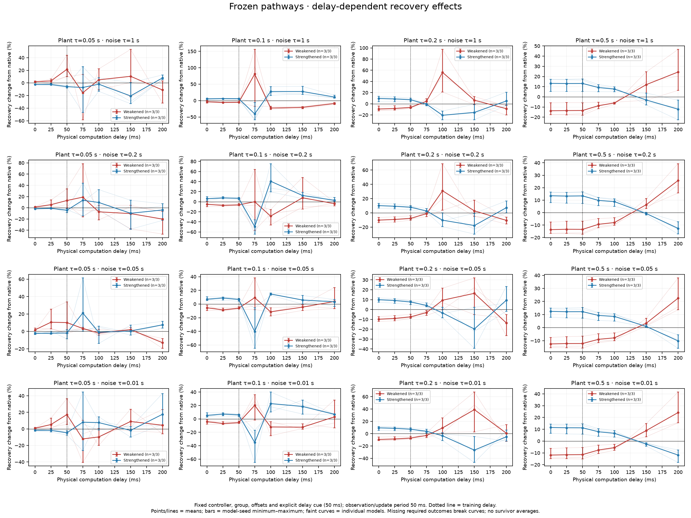
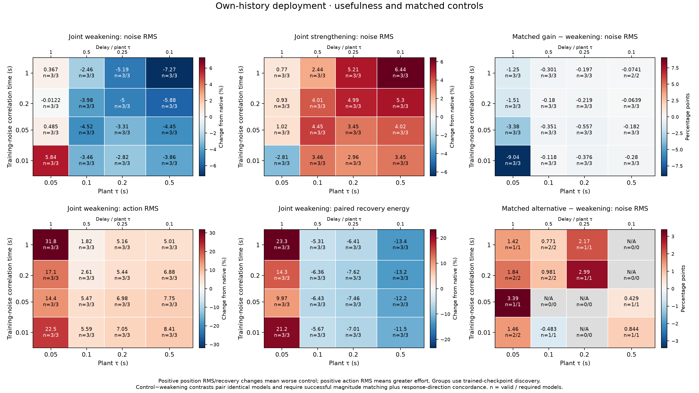
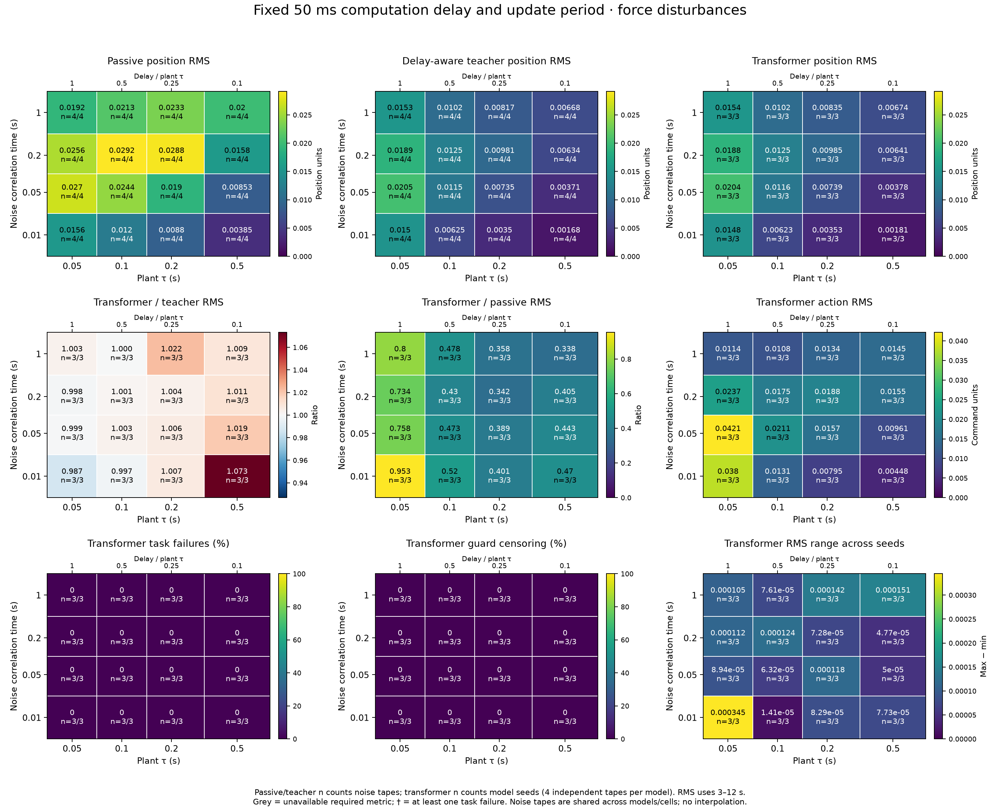

# Suppressive organization in transformer feedback control

Research project investigating whether emergent suppression and explicit excitation–inhibition inspired mechanisms improve the stability and responsiveness of transformer controllers when the environment evolves during computation.

**Central question:** Do suppressive mechanisms change the combined controller–environment dynamics beneficially, and does their causal contribution depend on the relationship between environmental timescales, observation-to-action latency, and fresh-feedback intervals?

**Status on 8 October 2026:** Independent training replication and frozen local-response corrections are complete: 40 fresh models plus 12 existing controllers, 14,538 physical trials/checks and eight new figure sets. In the fresh population, weakening improves four-second recovery at 50 ms but worsens it at 100 ms in 38/40 models. Equilibrium correction changes little; scalar compensation helps, and restoring local feedback shape adds a further benefit. Twelve-second results expose an unstable tail and disagreement between mean absolute and percentage effects. No explicit E/I-inspired architecture has been tested.

## First results

Read the [fresh replication and local-response correction report](results/kernel_rescue/README.md) and [plots](results/kernel_rescue/plots/). Forty newly trained models reproduce the timing effect: weakening changes four-second recovery by −7.43% at 50 ms and +33.52% at 100 ms. A correction fitted only at 50 ms reduces the 100 ms effect to +8.57% with scalar compensation and −0.96% with the complete local response. Paired inference uses ten initialization blocks. Local mode matching is by construction; transfer to independent noisy trajectories is the empirical result. Some native equilibria are unstable, and the twelve-second mean absolute residual remains adverse despite a slightly favorable mean percentage.


Read the [complete-loop dynamics and gain-rescue report](results/loop_mechanism/README.md) and [plots](results/loop_mechanism/plots/). Fresh disturbance tapes reproduce the recovery crossover: weakening changes error by −9.57% at zero delay and +23.54% at 100 ms. Independent gain-and-mean compensation reduces those effects to +0.13% and +8.54%. Full augmented-state analysis shows corresponding local damping changes. The crossover persists from 50 to 100 ms, where the inherited policies' equilibria and current-action-age features stay the same. This supports a timing-dependent feedback mechanism; it does not establish a uniquely inhibitory computation or independent training replication.


Read the [within-controller delay report](results/delay_sweep/README.md) and [plots](results/delay_sweep/plots/). The experiment holds each model's weights, pathways, intervention settings, explicit delay cue, plant and noise condition fixed and changes only physical command latency at fixed cadence. The 200 ms plant shows a useful-control crossover: weakening changes recovery error from −9.65% to +26.50% between 0 and 100 ms delay, while strengthening shows the opposite sign change. The report preserves the heterogeneous primary result, normalization dependence, gain-control explanation and failures at longer delays.



Read the [collective-suppression report](results/collective_suppression/README.md) and its [plots](results/collective_suppression/plots/). This saved-checkpoint follow-up surveys eight attention heads and both complete MLP residual branches, measures joint effects and interactions, compares initialization with training on common inputs, and tests frequency dependence and actual closed-loop usefulness. It keeps physical and relative suppression separate and preserves failed control matches. In the fastest plant/noise cell, weakening worsens recovery while matched output gain improves it; three model seeds and previously used trained models limit the interpretation.



Read the [two-timescale experiment report](results/timescale_maps/README.md) and its [2D plots](results/timescale_maps/plots/). Delay and update period are fixed at 50 ms, while plant tau and force-noise correlation time vary independently. Learned controllers improve over passive motion in all 16 cell means and remain close to the delay-aware teacher. Suppression, its change during learning, causal accuracy/effort effects and control-matching quality are plotted separately. The results show a timing-dependent contribution, with small effects and important matched-gain comparisons.



Read the [plant and feedback dynamics report](results/dynamics_validation/README.md). The plant characteristic timescale spans 500–50 ms against 50 ms controller updates. For the fastest plant, classical PD is stable at zero delay and unstable with one update of delay; all measured trajectory/growth checks agree with the predictions. Colored force and position-measurement noise have separately controlled correlation times from 10 ms to 1 s and produce distinct response curves. These checks establish the environment's properties before a new transformer experiment.

Read the [centered-intervention report](results/centered_suppression_pilot/README.md). Weakening a selected head by 10% with a calibrated command correction lowers mean incremental recovery error by 1.52% while raising effort by 2.43%. Centering removes most excess baseline drift, but the three models disagree on the primary delay interaction. All timing-specific control matches pass, and a simple matched gain increase achieves lower recovery cost in all 24 model × timing cells. The follow-up adds 832 calibration/probe and 48 numerical-check rollouts to its 2,816 confirmation rollouts.

Read the [causal suppression report](results/suppression_pilot/README.md). Weakening selected heads increased disturbance-evoked action responses by about 8–13% on discovery histories, with independent replication. In closed loop it reduced incremental recovery error while causing baseline drift; temporal effects and control matching did not establish the proposed beneficial mechanism. The report preserves failed matches and competence failures alongside all outcomes.

Read the [trained transformer pilot report](results/transformer_pilot/README.md). Mean held-out tracking RMSE is 0.2624 for the predictor teacher, 0.2629 for the transformer and 0.2635 for the matched-history MLP; all runs reached their horizon. The similar neural results establish usable baselines on this fixed, fully observed plant, without evidence for an attention-specific advantage.


Read the [baseline report and plots](results/baseline/README.md). The simulator reproduces analytical sampled-feedback trajectories, including a delay-induced unstable case. The pilot separates fixed-cadence delayed delivery from serial inference, where longer computation also reduces decision frequency.


These are frozen classical-controller checks with prescribed signals and gains. They validate the experimental platform; they are not evidence for the proposed transformer E/I mechanism.

The [transformer pilot protocol](docs/TRANSFORMER_PILOT.md) specifies the matched information boundary, independent episode splits, checkpoint selection and delayed feedback evaluation. [Results and provenance](results/transformer_pilot/) include configuration, training curves and per-episode scores. This is a fixed-plant feasibility experiment, not a test of architectural superiority or inhibition.

## Run locally

Python 3.11 or newer is required; the saved run used Python 3.12.7. Create an isolated environment and install the recorded dependency versions:

```bash
python3 -m venv .venv
.venv/bin/python -m pip install -r requirements-lock.txt
.venv/bin/python -m pip install --no-deps -e .
.venv/bin/python -m pytest -q
.venv/bin/python experiments/run_baseline.py
```

For an installation using compatible version ranges, use `pip install -e '.[dev]'` inside the environment instead. Exact dependency versions and source fingerprints accompany the saved run. The locked versions reflect this Linux/Python environment and may require a compatible interpreter on other platforms.

The runner reads [configs/baseline.json](configs/baseline.json). It saves compact reports, CSV scores, configuration and PNG/SVG figures in `results/baseline/`; selected complete traces go to ignored `runs/baseline/`. The configuration is for the declared three-task pilot and both timing schedules. Regenerating it replaces these generated artifacts.

For the neural pilot, install the pinned CPU PyTorch build in the same isolated environment. PyTorch is optional for the classical simulator:

```bash
.venv/bin/python -m pip install torch==2.5.1 --index-url https://download.pytorch.org/whl/cpu
.venv/bin/python -m pip install -r requirements-train-lock.txt
.venv/bin/python -m pytest -q
.venv/bin/python experiments/train_transformer.py --stage train --output runs/transformer_reproduction/results --artifacts runs/transformer_reproduction/artifacts
```

The training stage collects training and validation demonstrations, saves the best validation-loss checkpoint for each model/seed, and runs closed-loop validation. Inspect `training_summary.json`, `training_history.csv` and `validation_rollouts.csv` in the chosen output directory before starting final test evaluation:

```bash
.venv/bin/python experiments/train_transformer.py --stage evaluate --output runs/transformer_reproduction/results --artifacts runs/transformer_reproduction/artifacts
```

Use a new output/artifact directory for a fresh run; training refuses to overwrite a completed training manifest. Evaluation verifies the saved configuration and hashes of source, data, checkpoints and recorded training outputs before using them. Keep code and configuration unchanged between stages. The default settings are in [configs/transformer_pilot.json](configs/transformer_pilot.json); six models use the same observation histories and paired test scenarios. Large datasets and checkpoints remain under ignored `runs/`, while the saved project report uses `results/transformer_pilot/`.

The pilot uses prescribed virtual computation delays. Its separately measured CPU forward-pass latency excludes feature encoding and physical I/O and does not establish a real-time hardware control rate.

For the suppression experiment, use the exact hash-verified transformer checkpoints retained on this server under `runs/transformer_pilot/checkpoints/`. A fresh clone needs those checkpoint artifacts; newly trained weights require their own recorded provenance. Run the three independent stages into a fresh directory:

```bash
.venv/bin/python experiments/run_suppression.py --stage discover --output runs/suppression_reproduction/results --artifacts runs/suppression_reproduction/artifacts
.venv/bin/python experiments/run_suppression.py --stage calibrate --output runs/suppression_reproduction/results --artifacts runs/suppression_reproduction/artifacts
.venv/bin/python experiments/run_suppression.py --stage evaluate --output runs/suppression_reproduction/results --artifacts runs/suppression_reproduction/artifacts
```

Inspect discovery and calibration records before confirmation, without selecting new heads or retuning against outcomes. The runner checks unchanged sources, configuration, selected heads, snapshots and checkpoint bytes between stages. The [suppression protocol](docs/SUPPRESSION_PILOT.md) defines the frozen pilot settings, matched controls, paired endpoint and interpretation limits. Historical baseline manifests fingerprint their original implementation; reevaluating those historical artifacts requires that source version, while new training runs receive new fingerprints.

The [centered-intervention follow-up](docs/CENTERED_SUPPRESSION_PILOT.md) uses the same checkpoint artifacts and the head selection committed at `bebc9bd`, with fresh calibration and confirmation scenarios. It fits constant command offsets on native sham histories and matches controls separately for each timing condition:

```bash
.venv/bin/python experiments/run_centered_suppression.py --stage calibrate --output runs/centered_reproduction/results --artifacts runs/centered_reproduction/artifacts
.venv/bin/python experiments/run_centered_suppression.py --stage evaluate --output runs/centered_reproduction/results --artifacts runs/centered_reproduction/artifacts
```

Inspect `calibration_readiness.json` and record the decision before evaluation. Preserve failures without replacing heads or tuning against recovery outcomes. Keep sources, configuration, protocol, checkpoints, scenarios and calibration artifacts unchanged between stages; the runner verifies their fingerprints. Centering preserves the clipped command mean on calibration sham histories, so actual drift and signed held-action means are measured separately in closed loop.

The [dynamics-validation protocol](docs/DYNAMICS_VALIDATION.md) checks faster plants, delayed classical feedback and independently timed force or position-measurement noise. It uses the base scientific dependencies and does not require pretrained checkpoints:

```bash
.venv/bin/python experiments/run_dynamics_validation.py --output runs/dynamics_reproduction/results --artifacts runs/dynamics_reproduction/artifacts
```

Choose fresh directories. The runner records every analytical comparison, retains unstable cases and verifies unchanged source, configuration and protocol fingerprints. Colored inputs are stationary OU samples held on an independent 2.5 ms grid; sensor noise is evaluated at observation capture times. This validates the environment for subsequent neural-controller experiments.

The [fixed-delay force-noise map protocol](docs/TIMESCALE_MAPS_PILOT.md) trains three independent transformers in each of 16 plant/noise timing cells, then performs separate pathway discovery, calibration and confirmation:

```bash
.venv/bin/python experiments/run_timescale_maps.py --output runs/timescale_reproduction/results --artifacts runs/timescale_reproduction/artifacts
.venv/bin/python experiments/plot_timescale_maps.py --input runs/timescale_reproduction/results
```

Use fresh directories for a new experiment. The runner can resume an interrupted run with identical sources, configuration, protocol and completed artifacts. Initialization, epoch-25, selected and final weights remain in the artifact directory; compact results and PNG/SVG maps are written under the result directory. Force noise is the first channel; these models are trained by expert imitation and contain no explicit E/I component.

The [collective-suppression protocol](docs/COLLECTIVE_SUPPRESSION.md) analyzes those saved checkpoints with eight attention-head and two MLP-output gates. It adds joint interventions, common-input learning comparisons, frequency-resolved controller assays and fresh closed-loop confirmation:

```bash
.venv/bin/python experiments/run_collective_suppression.py --output runs/collective_reproduction/results --artifacts runs/collective_reproduction/artifacts
.venv/bin/python experiments/plot_collective_suppression.py --input runs/collective_reproduction/results
```

This follow-up requires the inherited checkpoint artifacts recorded in the timescale-map manifest. It verifies the parent bytes, saves its own probe banks and freezes discovery/calibration before confirmation. It does not retrain models. Frequency effects are measured on fixed teacher-generated histories; own-loop accuracy and recovery are reported separately.

The [frozen-controller delay protocol](docs/DELAY_SWEEP.md) holds each model, selected group, intervention settings, explicit delay input, plant and noise condition fixed while changing physical command latency at a 50 ms update cadence:

```bash
.venv/bin/python experiments/run_delay_sweep.py --output runs/delay_reproduction/results --artifacts runs/delay_reproduction/artifacts
.venv/bin/python experiments/plot_delay_sweep.py --input runs/delay_reproduction/results
```

This requires the collective experiment and all its inherited server-side artifacts, including weights, demonstration data and common-history banks, at their recorded paths. The runner verifies both generations of provenance. Gain controls retain their original 50 ms calibration; matching drift is measured without refitting. Four worker processes run independent simulations, with publication and sealing performed by the main process.

The [complete-loop mechanism protocol](docs/LOOP_MECHANISM.md) adds separate per-delay gain/mean calibration and the full history-and-command-pipeline dynamics for the twelve 200 ms plant controllers:

```bash
.venv/bin/python experiments/run_loop_mechanism.py --output runs/loop_mechanism_reproduction
.venv/bin/python experiments/plot_loop_mechanism.py --results runs/loop_mechanism_reproduction
```

This requires the preceding delay results and their inherited artifacts. Launch from clean committed scientific sources into a new empty directory. The runner seals all calibration records before confirmation and mechanism analysis; plots are written to the result directory's `plots/` subfolder. The report distinguishes four-second noisy task performance from local equilibrium stability and twelve-second map transients.

The [frozen local-response correction protocol](docs/KERNEL_RESCUE.md) fits equilibrium, scalar-gain and complete local command-response corrections once at 50 ms, then evaluates them unchanged at 50 and 100 ms. It adds forty models trained on independent demonstrations, alongside the twelve existing controllers:

```bash
.venv/bin/python experiments/run_kernel_rescue.py --output runs/kernel_reproduction/results --artifacts runs/kernel_reproduction/artifacts
.venv/bin/python experiments/plot_kernel_rescue.py --results runs/kernel_reproduction/results
```

Use clean committed scientific sources and fresh empty directories. The historical artifacts are required for the existing population and lineage verification. New demonstration data and all four checkpoints per fresh model are retained in the artifact directory. All corrections are sealed before confirmation; the primary analysis averages four noise conditions within each of ten fresh initialization seeds. Four-second and twelve-second results are reported separately.

## Read first

1. [Research background and proposal](docs/RESEARCH_PROPOSAL.md) — the complete conceptual argument, evidence, definitions, hypotheses, and intended contribution.
2. [Step by step starting plan](docs/START_HERE.md) — the first experiment, milestones, controls, measurements, and decision criteria.
3. [Neuroscience evidence](docs/notes/neuroscience_evidence.md) — cortical computation, population geometry, inhibition, and embodied dynamics.
4. [Transformer evidence](docs/notes/transformer_evidence.md) — recurrence, geometry, native suppression, explicit mechanisms, and real-time control.
5. [Source and provenance guide](docs/SOURCES.md) — primary references, version cautions, and connections to existing local research.
6. [Implemented experiment contract](docs/EXPERIMENT_CONTRACT.md) — timing conventions, information access, scoring, censoring, and the current pilot's limits.
7. [Transformer pilot protocol](docs/TRANSFORMER_PILOT.md) — teacher imitation, matched-history architectures, data splits, training and evaluation.
8. [Suppression pilot protocol](docs/SUPPRESSION_PILOT.md) — frozen-head discovery, independent calibration and paired causal interventions.
9. [Centered-intervention protocol](docs/CENTERED_SUPPRESSION_PILOT.md) — smaller interventions, sham command centering and controls matched within each timing condition.
10. [Dynamics-validation protocol](docs/DYNAMICS_VALIDATION.md) — separate plant, feedback and perturbation timescales, with analytical and stochastic-input checks.
11. [Two-timescale map design](docs/TIMESCALE_MAPS.md) — fixed delay and cadence, plant/noise axes, and distinct maps of accuracy, learned suppression and causal usefulness.
12. [First timescale-map protocol](docs/TIMESCALE_MAPS_PILOT.md) — the frozen force-noise grid, per-cell training, common-history checkpoint comparisons and held-out interventions.
13. [Collective-suppression protocol](docs/COLLECTIVE_SUPPRESSION.md) — ten-branch joint effects, learning-associated change, spectral selectivity and closed-loop usefulness.
14. [Frozen-controller delay protocol](docs/DELAY_SWEEP.md) — within-model latency interventions with fixed pathways, parameters and planned-delay cue.
15. [Complete-loop mechanism protocol](docs/LOOP_MECHANISM.md) — augmented physical dynamics and gain/mean compensation.
16. [Local-response correction and replication protocol](docs/KERNEL_RESCUE.md) — nested corrections frozen across latency and forty independently trained models.

## Implementation

| Module | Purpose |
|---|---|
| `plants.py` | Exact propagation of the normalized oscillator |
| `timing.py` and `records.py` | Virtual physical time and immutable controller-visible snapshots |
| `controllers.py` | PD, bounded-assumption predictor-PD, and analytical stability calculations |
| `signals.py` | Exogenous forcing independent of the controller schedule |
| `metrics.py` | Tracking, effort, variation, finite-horizon settling and explicit censoring |
| `imitation.py` | Shared bounded information, physical feature scaling and teacher demonstrations |
| `neural.py` | Causally masked transformer and matched-history MLP |
| `interventions.py` | Native head-contribution scaling and residual diagnostics |
| `suppression_tasks.py` | Paired disturbance/sham tasks and recovery/competence scoring |
| `suppression_analysis.py` | Functional suppression statistics and matched-control calibration |
| `centered_calibration.py` | Clipping-aware command offsets with equal scenario weighting |
| `centered_metrics.py` | Exact held-action means and sampled position means |
| `structured_signals.py` | Reproducible held OU/sinusoidal forcing and capture-time position noise |
| `dynamics_validation.py` | Independent ringdown, delayed recurrence, frequency-response and covariance references |
| `timescale_maps.py` | Per-cell imitation, paired force-noise trials and finite-horizon control metrics |
| `timescale_diagnostics.py` | Common-history checkpoint assays, head selection, centered controls and held-out causal effects |
| `collective_suppression.py` | Ten-branch survey, joint suppression and interaction effects across saved checkpoints |
| `collective_dynamics.py` | Frequency-resolved fixed-history assays and own-loop collective interventions |
| `delay_sweep.py` | Fixed-cue, fixed-parameter controllers across physical command latencies, with timing audits and passive references |
| `gain_rescue.py` | Independent per-delay waveform gain matching and gain/mean compensation with frozen confirmation |
| `loop_mechanism.py` | Complete observation-history and command-pipeline map, equilibrium modes, force responses and simulator parity |
| `kernel_rescue.py` | Causal equilibrium, scalar and local-response corrections frozen across latency, with complete-loop verification |
| `kernel_training.py` | Independent demonstration streams and inherited training/discovery rules for fresh replication |

Validation covers analytical dynamics, delayed-feedback trajectories, information causality, event ordering, saturation, deterministic replay, reporting-grid independence and metric definitions. Neural checks additionally cover future-token and padding isolation, shared-information encoding, gradients and checkpoint round trips. Virtual computation time is independent of Python runtime. The fixed-cadence schedule assumes idealized parallel throughput; it is not a single-processor deployment claim.

The divergence guard is checked at event times rather than continuously. The predictor knows applied commands but not pending commands, future disturbances or future references. The measured PD pilot does not use that predictor. See the experiment contract for the full limitations.

## Next milestone

The [fresh replication and local-response correction experiment](results/kernel_rescue/README.md) is complete. The next discriminating comparison separates current position/velocity, held-action and older-history correction terms. A subsequent training-delay × test-delay experiment would investigate adaptation during learning. Keep unstable conditions visible; a separate sensor-noise grid, direct closed-loop optimization and an explicit suppressive architecture remain later comparisons. The present result supports a feedback-law explanation beyond scalar gain, without establishing a uniquely inhibitory computation.

The primary research outcome remains the **stability–responsiveness tradeoff**, including disturbance recovery and delay tolerance at useful tracking performance. A reward increase, smaller actions, negative weights, or a static cancellation score alone would not establish the proposed mechanism.
