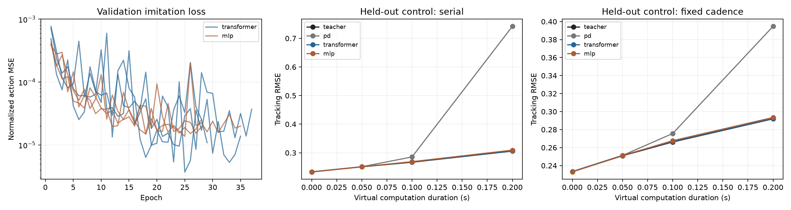

# Suppressive organization in transformer feedback control

Research project investigating whether emergent suppression and explicit excitation–inhibition inspired mechanisms improve the stability and responsiveness of transformer controllers when the environment evolves during computation.

**Central question:** Do suppressive mechanisms change the combined controller–environment dynamics beneficially, and does their causal contribution depend on the relationship between environmental timescales, observation-to-action latency, and fresh-feedback intervals?

**Status on 8 October 2026:** The expanded environment passes its dynamics validation: 192 physical rollouts, 254 main validation checks plus four successful reporting-resolution cases, and 318 software tests. Plant speed, delayed feedback and perturbation timescale can now be varied separately, with analytically verified stable and unstable regimes. The preceding centered-intervention follow-up contains 2,816 confirmation rollouts; its delay interactions disagree across models and matched output gain performs better. No explicit E/I-inspired architecture has been tested.

## First results

Read the [plant and feedback dynamics report](results/dynamics_validation/README.md). The plant characteristic timescale spans 500–50 ms against 50 ms controller updates. For the fastest plant, classical PD is stable at zero delay and unstable with one update of delay; all measured trajectory/growth checks agree with the predictions. Colored force and position-measurement noise have separately controlled correlation times from 10 ms to 1 s and produce distinct response curves. These checks establish the environment's properties before a new transformer experiment.

Read the [centered-intervention report](results/centered_suppression_pilot/README.md). Weakening a selected head by 10% with a calibrated command correction lowers mean incremental recovery error by 1.52% while raising effort by 2.43%. Centering removes most excess baseline drift, but the three models disagree on the primary delay interaction. All timing-specific control matches pass, and a simple matched gain increase achieves lower recovery cost in all 24 model × timing cells. The follow-up adds 832 calibration/probe and 48 numerical-check rollouts to its 2,816 confirmation rollouts.

Read the [causal suppression report](results/suppression_pilot/README.md). Weakening selected heads increased disturbance-evoked action responses by about 8–13% on discovery histories, with independent replication. In closed loop it reduced incremental recovery error while causing baseline drift; temporal effects and control matching did not establish the proposed beneficial mechanism. The report preserves failed matches and competence failures alongside all outcomes.

Read the [trained transformer pilot report](results/transformer_pilot/README.md). Mean held-out tracking RMSE is 0.2624 for the predictor teacher, 0.2629 for the transformer and 0.2635 for the matched-history MLP; all runs reached their horizon. The similar neural results establish usable baselines on this fixed, fully observed plant, without evidence for an attention-specific advantage.



Read the [baseline report and plots](results/baseline/README.md). The simulator reproduces analytical sampled-feedback trajectories, including a delay-induced unstable case. The pilot separates fixed-cadence delayed delivery from serial inference, where longer computation also reduces decision frequency.


These are frozen classical-controller checks with prescribed signals and gains. They validate the experimental platform; they are not evidence for the proposed transformer E/I mechanism.

The [transformer pilot protocol](docs/TRANSFORMER_PILOT.md) specifies the matched information boundary, independent episode splits, checkpoint selection and delayed feedback evaluation. [Results and provenance](results/transformer_pilot/) include configuration, training curves and per-episode scores. This is a fixed-plant feasibility experiment, not a test of architectural superiority or inhibition.

## Run locally

Python 3.11 or newer is required; the saved run used Python 3.12.7. Create an isolated environment and install the recorded dependency versions:

```bash
python3 -m venv .venv
.venv/bin/python -m pip install -r requirements-lock.txt
.venv/bin/python -m pip install --no-deps -e .
.venv/bin/python -m pytest -q
.venv/bin/python experiments/run_baseline.py
```

For an installation using compatible version ranges, use `pip install -e '.[dev]'` inside the environment instead. Exact dependency versions and source fingerprints accompany the saved run. The locked versions reflect this Linux/Python environment and may require a compatible interpreter on other platforms.

The runner reads [configs/baseline.json](configs/baseline.json). It saves compact reports, CSV scores, configuration and PNG/SVG figures in `results/baseline/`; selected complete traces go to ignored `runs/baseline/`. The configuration is for the declared three-task pilot and both timing schedules. Regenerating it replaces these generated artifacts.

For the neural pilot, install the pinned CPU PyTorch build in the same isolated environment. PyTorch is optional for the classical simulator:

```bash
.venv/bin/python -m pip install torch==2.5.1 --index-url https://download.pytorch.org/whl/cpu
.venv/bin/python -m pip install -r requirements-train-lock.txt
.venv/bin/python -m pytest -q
.venv/bin/python experiments/train_transformer.py --stage train --output runs/transformer_reproduction/results --artifacts runs/transformer_reproduction/artifacts
```

The training stage collects training and validation demonstrations, saves the best validation-loss checkpoint for each model/seed, and runs closed-loop validation. Inspect `training_summary.json`, `training_history.csv` and `validation_rollouts.csv` in the chosen output directory before starting final test evaluation:

```bash
.venv/bin/python experiments/train_transformer.py --stage evaluate --output runs/transformer_reproduction/results --artifacts runs/transformer_reproduction/artifacts
```

Use a new output/artifact directory for a fresh run; training refuses to overwrite a completed training manifest. Evaluation verifies the saved configuration and hashes of source, data, checkpoints and recorded training outputs before using them. Keep code and configuration unchanged between stages. The default settings are in [configs/transformer_pilot.json](configs/transformer_pilot.json); six models use the same observation histories and paired test scenarios. Large datasets and checkpoints remain under ignored `runs/`, while the saved project report uses `results/transformer_pilot/`.

The pilot uses prescribed virtual computation delays. Its separately measured CPU forward-pass latency excludes feature encoding and physical I/O and does not establish a real-time hardware control rate.

For the suppression experiment, use the exact hash-verified transformer checkpoints retained on this server under `runs/transformer_pilot/checkpoints/`. A fresh clone needs those checkpoint artifacts; newly trained weights require their own recorded provenance. Run the three independent stages into a fresh directory:

```bash
.venv/bin/python experiments/run_suppression.py --stage discover --output runs/suppression_reproduction/results --artifacts runs/suppression_reproduction/artifacts
.venv/bin/python experiments/run_suppression.py --stage calibrate --output runs/suppression_reproduction/results --artifacts runs/suppression_reproduction/artifacts
.venv/bin/python experiments/run_suppression.py --stage evaluate --output runs/suppression_reproduction/results --artifacts runs/suppression_reproduction/artifacts
```

Inspect discovery and calibration records before confirmation, without selecting new heads or retuning against outcomes. The runner checks unchanged sources, configuration, selected heads, snapshots and checkpoint bytes between stages. The [suppression protocol](docs/SUPPRESSION_PILOT.md) defines the frozen pilot settings, matched controls, paired endpoint and interpretation limits. Historical baseline manifests fingerprint their original implementation; reevaluating those historical artifacts requires that source version, while new training runs receive new fingerprints.

The [centered-intervention follow-up](docs/CENTERED_SUPPRESSION_PILOT.md) uses the same checkpoint artifacts and the head selection committed at `bebc9bd`, with fresh calibration and confirmation scenarios. It fits constant command offsets on native sham histories and matches controls separately for each timing condition:

```bash
.venv/bin/python experiments/run_centered_suppression.py --stage calibrate --output runs/centered_reproduction/results --artifacts runs/centered_reproduction/artifacts
.venv/bin/python experiments/run_centered_suppression.py --stage evaluate --output runs/centered_reproduction/results --artifacts runs/centered_reproduction/artifacts
```

Inspect `calibration_readiness.json` and record the decision before evaluation. Preserve failures without replacing heads or tuning against recovery outcomes. Keep sources, configuration, protocol, checkpoints, scenarios and calibration artifacts unchanged between stages; the runner verifies their fingerprints. Centering preserves the clipped command mean on calibration sham histories, so actual drift and signed held-action means are measured separately in closed loop.

The [dynamics-validation protocol](docs/DYNAMICS_VALIDATION.md) checks faster plants, delayed classical feedback and independently timed force or position-measurement noise. It uses the base scientific dependencies and does not require pretrained checkpoints:

```bash
.venv/bin/python experiments/run_dynamics_validation.py --output runs/dynamics_reproduction/results --artifacts runs/dynamics_reproduction/artifacts
```

Choose fresh directories. The runner records every analytical comparison, retains unstable cases and verifies unchanged source, configuration and protocol fingerprints. Colored inputs are stationary OU samples held on an independent 2.5 ms grid; sensor noise is evaluated at observation capture times. This validates the environment for subsequent neural-controller experiments.

## Read first

1. [Research background and proposal](docs/RESEARCH_PROPOSAL.md) — the complete conceptual argument, evidence, definitions, hypotheses, and intended contribution.
2. [Step by step starting plan](docs/START_HERE.md) — the first experiment, milestones, controls, measurements, and decision criteria.
3. [Neuroscience evidence](docs/notes/neuroscience_evidence.md) — cortical computation, population geometry, inhibition, and embodied dynamics.
4. [Transformer evidence](docs/notes/transformer_evidence.md) — recurrence, geometry, native suppression, explicit mechanisms, and real-time control.
5. [Source and provenance guide](docs/SOURCES.md) — primary references, version cautions, and connections to existing local research.
6. [Implemented experiment contract](docs/EXPERIMENT_CONTRACT.md) — timing conventions, information access, scoring, censoring, and the current pilot's limits.
7. [Transformer pilot protocol](docs/TRANSFORMER_PILOT.md) — teacher imitation, matched-history architectures, data splits, training and evaluation.
8. [Suppression pilot protocol](docs/SUPPRESSION_PILOT.md) — frozen-head discovery, independent calibration and paired causal interventions.
9. [Centered-intervention protocol](docs/CENTERED_SUPPRESSION_PILOT.md) — smaller interventions, sham command centering and controls matched within each timing condition.
10. [Dynamics-validation protocol](docs/DYNAMICS_VALIDATION.md) — separate plant, feedback and perturbation timescales, with analytical and stochastic-input checks.

## Implementation

| Module | Purpose |
|---|---|
| `plants.py` | Exact propagation of the normalized oscillator |
| `timing.py` and `records.py` | Virtual physical time and immutable controller-visible snapshots |
| `controllers.py` | PD, bounded-assumption predictor-PD, and analytical stability calculations |
| `signals.py` | Exogenous forcing independent of the controller schedule |
| `metrics.py` | Tracking, effort, variation, finite-horizon settling and explicit censoring |
| `imitation.py` | Shared bounded information, physical feature scaling and teacher demonstrations |
| `neural.py` | Causally masked transformer and matched-history MLP |
| `interventions.py` | Native head-contribution scaling and residual diagnostics |
| `suppression_tasks.py` | Paired disturbance/sham tasks and recovery/competence scoring |
| `suppression_analysis.py` | Functional suppression statistics and matched-control calibration |
| `centered_calibration.py` | Clipping-aware command offsets with equal scenario weighting |
| `centered_metrics.py` | Exact held-action means and sampled position means |
| `structured_signals.py` | Reproducible held OU/sinusoidal forcing and capture-time position noise |
| `dynamics_validation.py` | Independent ringdown, delayed recurrence, frequency-response and covariance references |

Validation covers analytical dynamics, delayed-feedback trajectories, information causality, event ordering, saturation, deterministic replay, reporting-grid independence and metric definitions. Neural checks additionally cover future-token and padding isolation, shared-information encoding, gradients and checkpoint round trips. Virtual computation time is independent of Python runtime. The fixed-cadence schedule assumes idealized parallel throughput; it is not a single-processor deployment claim.

The divergence guard is checked at event times rather than continuously. The predictor knows applied commands but not pending commands, future disturbances or future references. The measured PD pilot does not use that predictor. See the experiment contract for the full limitations.

## Next milestone

Freeze a neural-controller protocol for the validated plant-speed, feedback-delay and perturbation distribution. Establish competent classical and learned baselines on the selected cells before comparing suppression; the old transformer checkpoints were trained at one plant speed. Measure controller and joint-loop responses, including observation history, pending commands and dispatch phase, then compare selected-head changes with matched output gain using fresh perturbations. Direct closed-loop training and explicit E/I-inspired architectures remain subsequent research choices.

The primary research outcome remains the **stability–responsiveness tradeoff**, including disturbance recovery and delay tolerance at useful tracking performance. A reward increase, smaller actions, negative weights, or a static cancellation score alone would not establish the proposed mechanism.
