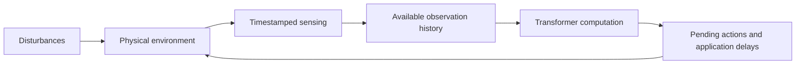

# Suppressive organization and the dynamics of transformer feedback control

Research background and experimental proposal, 7 October 2026.

## Research question and intended contribution

Do emergent or explicitly designed suppressive mechanisms in transformers improve the stability–responsiveness tradeoff of the combined controller–environment system? Does their causal contribution depend on how quickly task-relevant environmental dynamics evolve relative to computation and sensory feedback?

The motivating hypothesis is that suppressive organization may become especially consequential when the agent cannot finish computing before the world changes appreciably. In that regime, observations age during inference, actions may already be committed, and internal computation participates in a delayed physical feedback loop. The useful role of suppression could include regulation of gain, disturbance amplification, oscillatory modes, and recovery time.

This is a proposed mechanism, not an established benefit of E/I-inspired transformers. The first goal is a causal result in a controlled setting. A new architecture becomes justified only if explicit organization adds a reproducible advantage over learned mechanisms and matched alternatives.

The scientific contribution would be a link between identifiable suppressive pathways, physical timing, and the dynamics of the complete feedback system. Negative and conditional results are informative: native transformers may already learn adequate regulation; explicit suppression may merely lower gain; benefits may disappear when latency is accounted for; or delayed suppression may become harmful.

## How the discussion leads to this project

The discussion began with the intuitiveness of CNNs and RNNs compared with query–key–value attention. It progressed through cortical microcircuits, memory, recurrent formulations of transformers, low-dimensional population geometry, and learned inhibition. The decisive change in perspective was to examine a network embedded in an evolving environment.

The resulting chain of reasoning is:

1. Architecture defines possible information routing, memory, and interaction patterns.
2. Learned computation can contain suppressive functions without dedicated inhibitory populations.
3. Mathematical recurrence makes temporal analysis possible but does not by itself imply cortical dynamics.
4. Neural representations can have structured geometry without occupying one universal low-dimensional attractor.
5. In a fast feedback task, the relevant dynamical system includes the environment and the computation pipeline.
6. Suppressive organization could regulate that combined system; this requires an intervention experiment.

Broad architectural ideas such as predictive coding, recurrence, gating, normalization, and attractor refinement already have substantial precedents. Their combination is insufficient to establish novelty. The narrower causal and temporal hypothesis provides a more discriminating starting point.

## Attention and hierarchy as the architectural starting point

For input representations collected in a matrix X, a standard attention head computes Q = XW_Q, K = XW_K, and V = XW_V. Queries specify what a position seeks; keys specify how positions can be matched; values carry the information transmitted. Attention combines values using weights obtained from query–key compatibility. All three projections are learned jointly through the task loss. Their functionality follows from their position in the computation, rather than separate supervision naming a query, key, or value. [Vaswani et al., 2017](https://arxiv.org/abs/1706.03762)

Content-dependent routing offers flexible access to distributed context, while parallel training and short interaction paths help make this architecture practical. These advantages are an intuition for its success, not a complete theory explaining every scaling result.

Transformers are hierarchical in the sense that layers compose representations. A conventional language transformer does not impose the same progressive spatial pooling or locality hierarchy as a typical CNN. Global attention can connect distant positions early, while later layers can develop increasingly abstract or task-specific computations. This distinction matters because layer depth describes a computational hierarchy; it is not automatically a physical time axis.

## Cortical microcircuits as inspiration

Candidate accounts of cortical microcircuit computation include predictive coding, recurrent inference, normalization, amplification and selection, working-memory maintenance, and control of sensorimotor feedback. These accounts can overlap and need not describe every cortical area with equal fidelity.

Balwani, Cho, and Choi's computational study links biologically motivated cortical connectivity to architectural biases relevant to predictive coding. It supports a relationship between circuit structure, feedback, and the representation of expected versus unexpected inputs. It does not establish predictive coding as the unique computation performed by all cortical microcircuits. [Published study](https://doi.org/10.1162/neco.a.23)

For this project, the useful inspiration is an organization of opposing pathways with distinct recruitment and response properties. Spiking neurons are not required to test that principle. Continuous activations, signed pathways, gating, and explicit dynamical state are sufficient experimental tools. Whether any resulting mechanism resembles a particular biological regime is a separate question.

The [neuroscience evidence note](notes/neuroscience_evidence.md) documents the primary studies and the boundaries between these interpretations.

## Memory and recurrent formulations

The earlier memory discussion considered whether a finite neural state can encode enough information to reconstruct relevant aspects of its input history. HiPPO formalizes online memory as optimal projection of a history onto a chosen polynomial basis under a specified measure. This is important prior art for a general claim that memory can be designed as a reconstruction or approximation problem. It does not resolve how to choose task-dependent memories for an embodied controller or how suppression regulates a feedback loop. [Gu et al., NeurIPS 2020](https://arxiv.org/abs/2008.07669)

Related local Mamba and inverse-planning concepts are listed in [the provenance guide](SOURCES.md#related-local-research). They supply context rather than an established solution to the present question. HiPPO, inverse-Laplace memory models, selective SSMs, and arbitrary learned transformer memories should not be treated as identical constructions.

Two different transformer–RNN connections are relevant. Finite-feature linear attention admits a compact recurrent accumulation; this construction does not turn exact softmax attention into an arbitrary fixed-size finite state. Ordinary causal softmax attention also has an exact recurrent representation when its per-layer key–value history is retained as a growing state. Bounded compression is an additional operation with its own approximation consequences. [Katharopoulos et al., ICML 2020](https://proceedings.mlr.press/v119/katharopoulos20a.html); [Oren et al., EMNLP 2024](https://aclanthology.org/2024.emnlp-main.1043/)

Consequently, recurrent formulations provide legitimate dynamical state variables. They do not demonstrate mutually regulating E and I populations. Appending cached keys and values, repeatedly refining an action, feeding generated tokens back, and coupling actions to an external world are distinct kinds of recurrence and must be specified individually.

## Population geometry and the meaning of a trajectory

Low-dimensional structure is a useful hypothesis for both neural populations and artificial networks. Its meaning depends on what is sampled: inputs, tasks, time, layers, trials, or perturbations. A low-dimensional task-relevant readout can coexist with rich high-dimensional activity elsewhere in the same population.

Motor and cognitive studies provide examples of constrained neural trajectories and task-relevant population subspaces, while other experiments reveal high-dimensional sensory and behavioral representations. The project should therefore avoid a universal claim that cortex or transformers compute on one small manifold. Representative evidence and counterexamples are collected in [the neuroscience note](notes/neuroscience_evidence.md).

For transformers, distinguish four objects:

| Object | What varies | Interpretation |
|---|---|---|
| Representations across inputs | Samples at a fixed layer and defined token position | Geometry of the represented data distribution |
| A trajectory through depth | Layer index for one input or token | Composition of layer-specific transformations |
| A sequence-processing trajectory | Incoming observations, history, or generated tokens | Evolution of an explicitly defined controller state |
| A physical feedback trajectory | Wall-clock or simulated physical time | Coupled evolution of controller, environment, and pipeline |

A single smooth trajectory is curve-like by construction. Its appearance in two-dimensional PCA does not prove that nearby trajectories live on a robust low-dimensional invariant manifold. Evidence should include held-out trajectories, dimension-estimation controls, perturbations, and predictive adequacy of a reduced state. A small number of layers also imposes a trivial sample-rank bound on any single-pass analysis.

Geometry can help identify modes whose amplification suppression regulates. It is an optional mechanistic analysis, not a prerequisite or proof of E/I balance. See [the transformer evidence note](notes/transformer_evidence.md) for studies of representation dimension and trajectories.

## Suppression and E/I balance are distinct claims

Use the following vocabulary consistently:

| Claim | Required interpretation |
|---|---|
| Signed influence | A specified pathway increases or decreases a specified target under a defined intervention |
| Functional suppression | A pathway causally limits a target signal or opposing computation in a relevant context |
| Explicit inhibitory organization | The architecture assigns a specified suppressive role to pathways or populations |
| Opposing-drive balance | Substantial opposing influences track or compensate across conditions under a defensible decomposition |
| Inhibitory stabilization | A dynamical instability is controlled by responsive inhibition under an explicitly defined circuit model |
| Strong-coupling balanced regime | Population statistics and responses satisfy a specified balanced-network theory |

These form related research questions, not a sequence of automatic implications. Balanced-network regimes and inhibition-stabilized networks are also distinct theoretical notions. A negative weight is insufficient for either. Biological evidence for inhibition-stabilized operation involves predictions and perturbations of recurrent circuitry. [Sanzeni et al., eLife 2020](https://elifesciences.org/articles/54875)

Native language transformers already show meaningful suppression. Copy-suppression heads oppose earlier copying predictions; self-repair studies show that downstream responses can compensate for lesions. These findings motivate looking for analogous functional organization in controllers. They do not establish that the same pathways or functions appear in a robot policy. [McDougall et al., BlackboxNLP 2024](https://aclanthology.org/2024.blackboxnlp-1.22/); [Rushing and Nanda, ICML 2024](https://arxiv.org/abs/2402.15390)

Several methodological distinctions are essential:

- Neural suppression and behavioral braking are different. An internally excitatory pathway can command an opposing physical force.
- Softmax competition, normalization, and coordinate signs can create apparent opposition without a specialized learned suppressor.
- Feature bases and pathway grouping affect cancellation measurements. Artificially splitting a contribution into large cancelling terms cannot establish a new mechanism.
- Large positive and negative random sums can nearly cancel without responsive regulation.
- Feedforward compensation through later layers is not, by itself, feedback to earlier layers.
- Stable neural activations do not imply a stable physical control loop.

The project's primary label should therefore be **suppressive organization**. Stronger E/I claims require additional evidence.

## What deliberately suppressive transformers already establish

Differential Attention and related variants explicitly subtract attention contributions. Other architectures use gates, competition, self-inhibition, or recurrent refinement inspired by cortical motifs. Their existence means that adding an inhibitory-looking operation is not itself a new research contribution.

The Controlled Dynamics Attractor Transformer is relevant to excitation and self-inhibition during iterative computation, but its reported applications are graph classification and anomaly detection. Those evaluations do not establish stabilization of a coupled physical plant. The exact architecture and evidence are described in [the transformer note](notes/transformer_evidence.md).

Two closer embodied comparisons are useful. A 2025 workshop study of transformers in online continuous-control RL did not find a consistent overall advantage from Differential Attention. AmpAttention applies subtractive attention to robotic manipulation with a perceptual filtering rationale. Neither study establishes an inhibition-specific effect on delay tolerance or joint damping. [Online RL workshop paper](https://openreview.net/pdf?id=nfh9PSaASy); [AmpAttention manuscript](https://arxiv.org/abs/2607.02845)

Architectural uptake and scientific mechanism must be assessed separately. A useful suppressive component need not replace the transformer family to matter. Conversely, improved benchmark performance or adoption would not prove the proposed E/I explanation. The alternatives are broader than “transformers already have all necessary inhibition” and “biology holds an undiscovered breakthrough”: optimization, task choice, compute cost, timing, and incorrect biological abstractions could all determine the result.

## Neuroscience and artificial controllers in a physical loop

The broader principle that inhibition can shape sensorimotor dynamics has strong precedents. Fink and colleagues linked disruption of spinal presynaptic inhibition to oscillatory reaching and modeled its relationship to sensory feedback gain. This is particularly relevant evidence about a body–neural loop, although it is not a cortical transformer analogy. [Fink et al., Nature 2014](https://doi.org/10.1038/nature13276)

Buckley and Toyoizumi examine how feedback through the environment changes neural computation, and Demarchi and colleagues investigate sensorimotor dynamics under altered feedback conditions. These studies motivate explicit treatment of the environment as part of the dynamical system. Their results should not be described as cell-specific proof of E/I stabilization unless the corresponding inhibitory mechanism was manipulated. [Primary evidence and interpretation](notes/neuroscience_evidence.md)

Nonspiking neural control architectures and central-pattern-generator models also use excitatory and inhibitory motifs to organize behavior. Their architectural benefits are relevant precedents, but sign constraints, topology, oscillatory state, parameter count, and training conditions can change together. A transformer study must isolate its own mechanism rather than inherit a causal interpretation from those results.

## Why timing changes the computational problem

Turn-based interaction is already a closed loop: one participant's response changes the other's next input. The additional issue is whether task-relevant environmental state evolves substantially during computation. A long turn does not make an independently evolving world stationary.

Let tau_env denote a task-relevant environmental response time, d the effective age from sensing to applied action, and h the interval between fresh feedback updates. The dimensionless quantities d/tau_env and h/tau_env describe two different temporal demands. There is no universal critical value of one; gain, phase, noise, model error, actuator limits, and the environment's spectrum also matter.

A high actuator command rate can coexist with slow feedback because an action chunk is being played back. Computation latency is also different from an internal neural relaxation time. A feedforward module can change closed-loop dynamics through its input–output gain and delay, while a claim about internal E/I time constants requires actual dynamical state or an explicit temporal update.

Serial inference introduces another coupling: increasing computation duration usually reduces the frequency of fresh policy decisions. Keeping sensor sampling fixed does not isolate these effects. The experiment therefore needs both a realistic serial schedule and an idealized fixed-cadence delayed-delivery control, with the latter's extra throughput made explicit.

The complete state should include physical state, controller memory or observation history, pending actions, and relevant scheduling state. The feedback path is:

In a fixed-cadence discrete formulation, the augmented transition can be written as

    X_(k+1) = F_theta(X_k, disturbance_k).

The local Jacobian of this augmented transition can describe stability near a suitable equilibrium. The Jacobian of an isolated transformer layer cannot replace it. Variable scheduling and action arrivals can require a hybrid or event-driven model. Finite-time amplification, nonnormality, saturation, and nonlinear transitions also limit conclusions from local eigenvalues.

An illustrative linear example makes the timescale issue concrete:

    tau_h * dh/dt = -h - k*x
    tau_x * dx/dt = -x + h,       k > 0.

If the internal state responds much faster than x, then h approximately equals -k*x and the reduced physical response is monotone relaxation. When tau_h = tau_x = tau, the eigenvalues are (-1 ± i*sqrt(k))/tau: the joint system has damped oscillatory modes. This example remains stable for all positive k and time constants. Timescale overlap can change transient behavior without automatically creating an instability or a Hopf bifurcation.

## Direct transformer precedents for real-time feedback

RTC predicts new action chunks while previous actions execute and explicitly addresses inference delay and continuity. REMAC trains policies to accommodate mismatches between current perception and already committed actions. Its real-robot setup operates at 15 Hz with approximately 122–140 ms end-to-end inference latency and additional injected delays. These studies establish that temporal deployment is experimentally consequential. [RTC](https://arxiv.org/abs/2506.07339); [REMAC](https://arxiv.org/abs/2601.20130)

The July 2026 piR2 preprint supplies fresh proprioception at successive action-denoising calls while vision–language features update asynchronously. It reports approximately 25 Hz closed-loop replanning on its physical platform. This gives a concrete example of feedback influencing ongoing iterative action generation; it does not imply that every sensory modality refreshes equally fast. [piR2](https://arxiv.org/abs/2607.26055)

These are precedents for timing and reactivity, rather than direct evidence for the proposed inhibitory mechanism. “Continuous control” by itself may refer only to continuous-valued actions; a simulator that stops during inference does not instantiate the same timing problem. Internal inference stability and autoregressive forecasting called “closed loop” are likewise insufficient substitutes for a controlled external plant.

## Falsifiable hypotheses

**H1 — Emergence.** Training ordinary transformers under different temporal demands changes the presence, recruitment, or organization of functionally suppressive pathways. Candidate discovery must be independent of the final tests, and effects must survive simple activity and norm controls.

**H2 — Causal temporal interaction.** Attenuating identified suppression changes joint-system disturbance responses or delay tolerance more strongly in some demanding timing regimes than in slow regimes. This need not be monotonic; excessive or delayed suppression may worsen performance.

**H3 — Explicit organization.** A deliberately suppressive or E/I-inspired component improves the stability–responsiveness frontier beyond an unconstrained alternative matched for state, capacity, update schedule, and computational resources.

The proposed constraint must change something substantive: an unrestricted branch preceded by a minus sign can be absorbed into its learned weights. Constrained attenuation, specified sign-consistent pathways, or a defined dynamical recruitment rule are candidate biases; subtraction alone is not evidence of a different model class.

**H4 — Mechanism.** Benefits correspond to predictable changes in disturbance amplification, effective gain, phase, or dynamical modes. A reward increase alone cannot establish this claim.

**H5 — Stronger balance hypothesis.** If substantial opposing drives are identified, their coordinated responses explain behavior beyond their instantaneous sum, activation magnitude, and simpler gain models. This is optional follow-up work; it is not required for a useful result on H2.

Training-time emergence and deployment-time causal dependence must be crossed experimentally. A fixed trained model can become more dependent on a pathway under faster dynamics without having learned a different organization.

## Operational definition and causal tests

Define suppression relative to a target signal whose orientation and behavioral relevance are established independently. Physical action coordinates offer one stable reference; validated internal features offer another. Use weights, direct attribution, and correlations to discover candidates, then test their actual causal effects with the native downstream computation intact.

Use moderate graded pathway scaling, matched random or nonsuppressive interventions, and restoration of the original pathway contribution. A complete ablation can damage representation generally and is a weaker first diagnostic. Freeze or replay a pathway only where the counterfactual remains semantically and temporally meaningful. After closed-loop trajectories diverge, replayed activations from a different physical trajectory can be misleading.

An optional descriptive measure decomposes incoming contributions to target j into positive drive E_j and opposing magnitude I_j, with cancellation index

    B_j = (E_j - I_j) / (E_j + I_j + epsilon).

Report total drive, bias, thresholds, and unexplained residual as well. Near-zero B with negligible drive is not substantial balance. Fix the decomposition, test alternatives, and compare against random signed-sum nulls. This index does not establish biological E/I balance or a unique internal state.

The strongest early result would combine a temporally selective effect, a predicted change in joint dynamics, and rescue while retaining useful responsiveness. Equalizing low-frequency gain or comparing complete tracking–stability frontiers helps distinguish organized regulation from simply moving less.

## Step by step route to the first result

The detailed implementation sequence and acceptance criteria are in [START_HERE.md](START_HERE.md). The stages are:

1. Fix definitions, the primary timing-by-intervention contrast, held-out conditions, and failure criteria.
2. Build a continuously evolving plant with an explicit event schedule and no future-information leakage.
3. Validate classical delayed-feedback behavior and numerical convergence.
4. Train competent small ordinary transformer policies using a common training protocol; retain classical and simple neural baselines.
5. Map baseline behavior across delay, feedback cadence, and plant timescale before searching for mechanisms.
6. Discover suppressive candidates on separate data and run graded interventions, controls, and rescue on held-out conditions.
7. Introduce one explicit mechanism with a properly matched unconstrained control.
8. Replicate across seeds, disturbances, and a second plant; separate virtual-delay mechanism tests from measured hardware latency.
9. Evaluate stronger balance and low-dimensional-state hypotheses only where the initial evidence warrants them.

Start with full state observation and a linear oscillator, then an unstable or nonlinear plant such as an inverted pendulum. A stable passive oscillator is useful for validation but cannot be allowed to reward inactivity. Tracking, disturbance rejection, effort, and response speed must be scored alongside stability.

## Interpretation and publication boundaries

| Outcome | Defensible interpretation |
|---|---|
| Native pathways affect timing-dependent dynamics and rescue works | Learned suppression has a causal role in this controller and regime |
| Explicit mechanisms help after matching state, resources, and timing | Evidence for a useful architectural bias under specified conditions |
| Effects disappear after matching gain or action magnitude | Consistent with a simpler scaling explanation; reproducing the dynamical response with that control is needed to establish it |
| Advantages disappear at measured hardware latency | A mechanistic effect may exist without practical deployment benefit |
| More suppression causes oscillation or poorer tracking | Timing and strength are consequential; suppression is not universally beneficial |
| Standard transformers match explicit variants | A new architecture is unnecessary for the tested regime |
| A cancellation index correlates with performance but interventions fail | Descriptive opposition, without established regulation |

Do not claim that cortex is equivalent to a transformer, that every transformer is a fixed-state RNN, that low dimension implies attraction, or that a stable inference process guarantees stable control. No universal advantage, biological equivalence, or priority claim follows from this proposal.

The first publishable target is a reproducible causal account of suppression under temporal demands. A compelling negative result should identify which simpler explanation or limitation accounts for the outcome.
