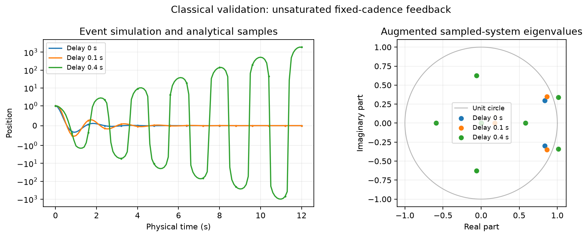
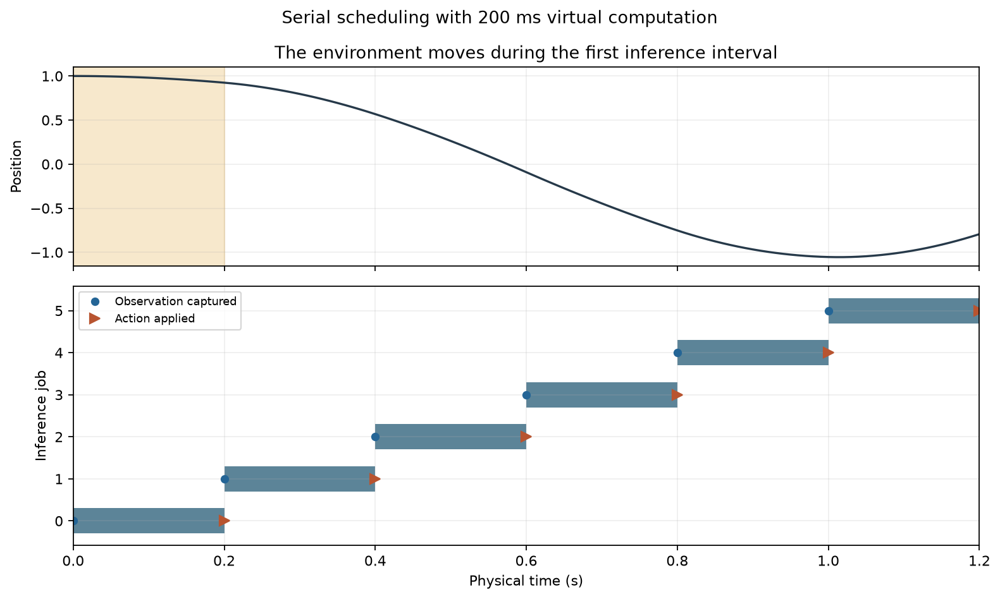
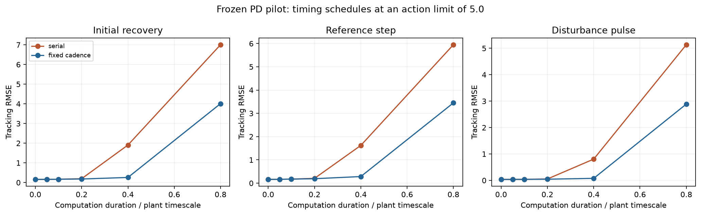

# Classical control and timing validation

This is a deterministic simulator-validation pilot. No transformer was trained for this classical milestone and no inhibitory mechanism was tested. The follow-up transformer/MLP experiment has a [separate protocol](../../docs/TRANSFORMER_PILOT.md) and [results directory](../transformer_pilot/).

## Analytical checks

Unsaturated fixed-cadence control at 0.1 s intervals, compared against an independent sampled recurrence. The initial command is zero until the first delayed result arrives.

| Delay in seconds | Spectral radius | Maximum trajectory error |
|---|---|---|
| 0.00 | 0.887268 | 0 |
| 0.10 | 0.930549 | 0 |
| 0.40 | 1.069654 | 0 |

A spectral radius below one indicates local linear stability for this fixed-cadence, unsaturated model. These eigenvalues do not describe the serial or saturated pilot curves.



## Timing and pilot results





The same frozen gains and exogenous signals are used in all 36 pilot rollouts. Fixed-cadence dispatch has idealized parallel throughput; serial inference changes both decision cadence and observation age. The action limit is specified in config.json. These illustrative curves are not an optimized-controller comparison or evidence for E/I organization.

| Schedule | Compute seconds | Mean decision interval | Pulse tracking RMSE | Pulse action effort |
|---|---|---|---|---|
| serial | 0.000 | 0.010 | 0.035814 | 0.099431 |
| serial | 0.025 | 0.025 | 0.038026 | 0.115743 |
| serial | 0.050 | 0.050 | 0.040999 | 0.139453 |
| serial | 0.100 | 0.100 | 0.052937 | 0.246866 |
| serial | 0.200 | 0.200 | 0.804994 | 49.143900 |
| serial | 0.400 | 0.400 | 5.136508 | 156.285095 |
| fixed_cadence | 0.000 | 0.010 | 0.035814 | 0.099431 |
| fixed_cadence | 0.025 | 0.010 | 0.037327 | 0.110405 |
| fixed_cadence | 0.050 | 0.010 | 0.039188 | 0.124521 |
| fixed_cadence | 0.100 | 0.010 | 0.044531 | 0.168358 |
| fixed_cadence | 0.200 | 0.010 | 0.076718 | 0.535756 |
| fixed_cadence | 0.400 | 0.010 | 2.888454 | 133.740016 |

## Reporting grid convergence

For each task, the fixed-cadence condition closest to 0.1 s computation is checked while halving the reporting interval. This is a representative convergence check, not refinement of every sweep condition. Error integrals and peaks are sampled estimates; held-action effort is integrated from application events. The numerical divergence guard is event-sampled, so censoring must also be checked when refining the reporting grid.

| Task | Computation seconds | Relative change in tracking ISE | Relative change in peak error |
|---|---|---|---|
| initial_recovery | 0.100 | 6.39e-09 | 0 |
| reference_step | 0.100 | 0.00578 | 0 |
| disturbance_pulse | 0.100 | 2.16e-08 | 1.16e-15 |

## Reproduce and inspect

From the repository root:

```bash
.venv/bin/python -m pytest -q
.venv/bin/python experiments/run_baseline.py
```

- `config.json` preserves all pilot settings; `metrics.csv` contains every rollout's scores and measured decision timing.
- `validation.json` and `convergence.json` contain the analytical and reporting-grid checks.
- `manifest.json` records dependency versions and a SHA256 fingerprint of source, experiment scripts, and configs.
- Selected complete event traces are written to ignored `runs/baseline` as compressed JSON; other rollouts are reproducible from the configuration.
- A censored rollout has unavailable full-episode scores, not a deceptively small truncated error. No task-success threshold has been declared.

Source fingerprint: `cb7a2a42e6ae9a2edb25eab7c4888d4f5625f84535caabf44c4e771b6b2a326d`.

The follow-up [causal transformer imitation pilot](../../docs/TRANSFORMER_PILOT.md) compares a transformer, a matched-history MLP and an equally informed classical teacher. Its [results](../transformer_pilot/) are recorded separately from this historical simulator validation. Suppressive-pathway discovery starts after competent control and independent evaluation are established.
