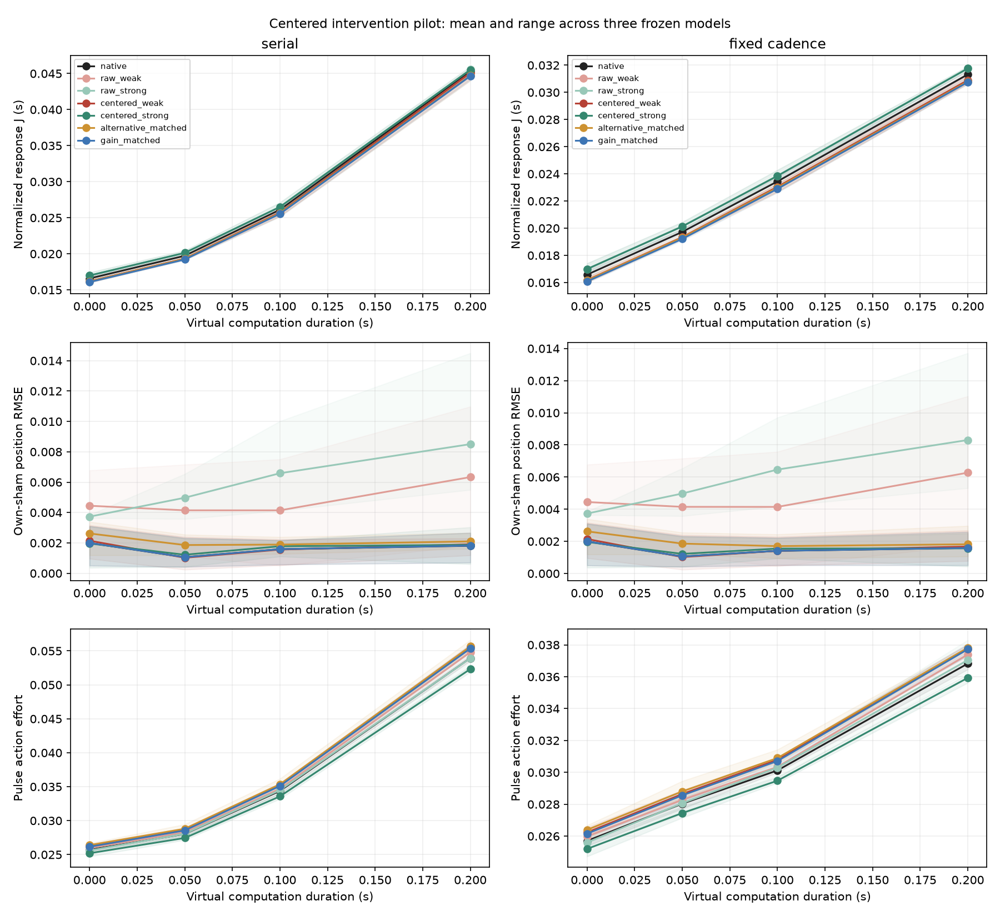

# Small centered interventions in suppressive transformer heads

Experiment dated 8 October 2026. This follow-up uses the three frozen imitation-trained transformers and the selected heads from the [first suppression pilot](../suppression_pilot/README.md). The [prospective protocol](../../docs/CENTERED_SUPPRESSION_PILOT.md) and [configuration](config.json) were frozen before calibration and confirmation. No model was retrained and no head was reselected.

**Complete:** 2,816 confirmation rollouts, 832 calibration/probe rollouts and 48 supplemental numerical-check rollouts; 252 tests pass. Centering substantially reduces baseline drift while preserving the small recovery effect of weakening a suppressive head. The primary delay interaction disagrees across models, and an ordinary matched gain increase achieves lower recovery cost in every model × timing cell. These results establish a local functional effect, without establishing a consistent beneficial temporal role for the selected suppression.

## Design and calibration

The seven variants are native, candidate-head scaling at `0.9` and `1.1` with and without a constant command correction, a centered alternative-head control, and a centered output-gain control. Offsets match the clipped command mean on native calibration sham histories. Control strengths match the immediate RMS command change of the centered weakened candidate separately for each model, schedule and delay. Confirmation controllers then act on their own evolving histories, using the same intervention in each pulse and sham pair.

The plant has time constant `0.5 s` and damping ratio `0.15`. Observation and fixed-cadence decision intervals are `0.05 s`, with virtual computation durations `0`, `0.05`, `0.1` and `0.2 s`; a separate serial schedule changes both delay and decision cadence. Five-second episodes use zero initial state and reference and a `0.25 s` disturbance of signed magnitude `0.3–0.6`. Four fresh calibration scenarios and eight fresh confirmation scenarios are paired across models and conditions. Repeated deterministic shams and timing repetitions are not independent environmental draws.

All 24 native competence checks, 48 centered-candidate drift checks, and 48 control-matching checks passed calibration. The largest selected-setting mean residual was `9.97e-11`, below the `1e-10` tolerance; the largest control RMS mismatch was `2.15%`, below the `5%` bound. The largest centered-candidate sham-RMSE increase over native was `0.000534`, below the `0.005` drift bound. The [readiness decision](readiness_decision.json) was recorded before confirmation; no settings were changed.

| Training seed | Response increase from centered weakening | Positive calibration scenarios | Alternative-head scale range | Output-gain range |
|---:|---:|---:|---:|---:|
| 11 | 1.737% | 4/4 | 0.855–0.865 | 1.017–1.018 |
| 22 | 2.358% | 4/4 | 0.750–0.835 | 1.020–1.026 |
| 33 | 1.624% | 4/4 | 0.785–0.850 | 1.019–1.020 |

Response increases are median fractional changes in amplitude-normalized RMS pulse-minus-sham command response on fixed native histories at fixed cadence and `0.05 s` delay. Strengthening decreases this response in all three models. Raw and centered fixed-history response changes coincide here: without clipping, a constant offset cancels algebraically in the pulse-minus-sham subtraction. Their equality is not independent evidence for preserved closed-loop behavior. The deployment comparison below tests whether response effects persist with little drift on the intervened controller's own trajectories.

## Outcomes and interpretation

The primary response score `J` integrates squared pulse-minus-own-sham position over the three seconds after disturbance offset, divided by squared disturbance amplitude. Lower values mean better incremental recovery; this score alone does not measure absolute tracking or asymptotic stability.

The following descriptive means weight each model, timing cell and confirmation scenario equally. Every transformer variant has 192 pulse/sham pairs (384 rollouts); the teacher has 64 pairs (128 rollouts) and is not repeated across training seeds.

| Variant | Mean J (s) | Pulse tracking RMSE | Own-sham RMSE | Pulse action effort |
|---|---:|---:|---:|---:|
| Native | 0.02484755 | 0.03408680 | 0.00156361 | 0.03284240 |
| Raw weakened | 0.02446999 | 0.03487564 | 0.00476050 | 0.03322111 |
| Raw strengthened | 0.02523613 | 0.03415691 | 0.00590894 | 0.03288605 |
| Centered weakened | 0.02447028 | 0.03379900 | 0.00161058 | 0.03364009 |
| Centered strengthened | 0.02523427 | 0.03438139 | 0.00164088 | 0.03207511 |
| Centered alternative | 0.02438252 | 0.03385103 | 0.00205899 | 0.03376608 |
| Centered gain | 0.02430373 | 0.03370395 | 0.00156645 | 0.03354067 |
| Predictor-PD teacher | 0.02478765 | 0.03405499 | 0 | 0.03215857 |

Centered weakening reduces mean `J` by **1.518%** and raises pulse action effort by **2.429%** relative to native. Its mean pulse action variation rises from `0.983472` to `1.003780`. The mean recovery effect persists after bias correction, while own-sham RMSE falls from `0.00476050` for raw weakening to `0.00161058` for centered weakening, close to native `0.00156361`. Actual signed held-action means on shams are `+0.0008990` for native, `−0.0039716` for raw weakening and `+0.0008606` for centered weakening. Centering helps on the controller's own trajectory, but does not impose exact equality there.

The gain control reduces mean `J` by **2.189%** with **2.126%** more effort than native. It has lower `J` than centered weakening in all 24 model × timing cells. The alternative head reduces mean `J` by **1.872%** with **2.812%** more effort and has lower `J` than centered weakening in 19/24 cells. These magnitude-matched controls do not establish equivalence of feedback laws, but they prevent attributing the recovery improvement to a unique advantage of the selected pathway. The alternative heads are not established nonsuppressive controls.

### Primary temporal contrast

For fixed-cadence dispatch, let `Delta J(d) = J_centered weakened(d) − J_native(d)` and `I = mean[Delta J(0.2) − Delta J(0)]`, with scenario pairing retained. Values in the next two tables are in **10⁻⁶ seconds**.

| Training seed | Delta J at zero delay | Delta J at 0.2 s | Primary I | Scenarios with positive I |
|---:|---:|---:|---:|---:|
| 11 | −357.941 | −477.114 | −119.173 | 0/8 |
| 22 | −520.709 | −504.841 | +15.867 | 8/8 |
| 33 | −330.230 | −307.045 | +23.186 | 8/8 |

Centered weakening lowers mean recovery cost at every fixed-cadence delay for all three models. Positive interactions for seeds 22 and 33 mean **less improvement at longer delay**, not that weakening harms recovery there. The opposite sign for seed 11 prevents a consistent temporal conclusion across models; repeated scenarios cannot substitute for additional independently trained models.

| Training seed | Centered weakening I | Raw weakening I | Alternative I | Gain I |
|---:|---:|---:|---:|---:|
| 11 | −119.173 | −133.659 | −140.897 | −121.061 |
| 22 | +15.867 | −16.174 | −32.210 | +1.350 |
| 33 | +23.186 | +30.730 | −107.648 | −98.470 |

The sign change between raw and centered weakening for seed 22 illustrates why a small temporal contrast cannot be interpreted without checking the operating-point shift. The [paired candidate-minus-control contrasts](paired_interaction_contrasts.csv) retain each scenario; no significance claim is made from three models.

Across both schedules, centered weakening lowers mean `J` in **23/24** cells. The exception is seed 33 under serial inference at `0.2 s`, where `Delta J = +0.0000769020` (`+0.169%`). Centered strengthening raises mean `J` in 23/24 cells, with the same serial cell the exception. Serial interactions are secondary because increasing computation time also changes decision cadence.

### Drift, completion and numerical checks

All 2,816 confirmation rollouts completed; there were no absolute-competence failures or applied-command clipping. Native competence passed 24/24 cells. All four centered variants passed all 96 drift checks. Raw weakening failed 8/24 drift checks and raw strengthening failed 7/24; all 15 failures remain in [confirmation competence](confirmation_competence.json). These are failures of the separate `0.005` sham-RMSE-gap criterion despite passing the broader absolute-competence bounds.

Calibration and confirmation sham means coincide for a fixed variant and timing condition because the sham trajectories are deterministic and identical. Their repeated values are not fresh independent evidence. Pulse outcomes use the fresh confirmation disturbance scenarios.

The [supplemental convergence check](convergence.json) compares reporting intervals `0.01` and `0.005 s` on one calibration scenario, native and centered weakening, all three models and fixed-cadence delays `0` and `0.2 s`: 12 paired comparisons, 48 rollouts. The largest absolute change in `J` is `1.30e-6`, and the largest relative change is `0.00546%`. Applied command values and timestamps are identical; the largest shared-grid position difference is `6.38e-16`. The three corresponding temporal interactions change by at most `6.36e-9`, with unchanged signs. This is representative reporting-grid validation, not a convergence check of every confirmation case.

All source, protocol, checkpoint, calibration and confirmation fingerprints still verify. The 252 tests include clipping-aware centering, equal scenario weights, exact held-action means, own-sham pairing, per-condition matching, zero-target handling and stage-integrity checks. Total executions for this experiment are **3,696 rollouts**, including repeated shams and numerical checks.

Lines show means across three models after averaging scenarios; shading is the model range, not a confidence interval. Fixed-cadence and serial schedules are shown separately.

### What this supports next

The current results are compatible with a small feedback-gain change plus pathway-specific differences that depend on timing. They do not identify gain, damping, phase lag or stability margins directly. A useful next experiment is to estimate the local response of the full delayed controller–plant system around its sham operating trajectory, retaining observation history, pending commands and dispatch phase. Compare that response with matched output gain, then validate its predictions with fresh small disturbances. Broader plant-timescale sweeps, direct closed-loop training and explicit E/I architectures should follow a separately frozen protocol.

## Artifacts and reproduction

The [runner](../../experiments/run_centered_suppression.py) separates calibration and confirmation. [Repository instructions](../../README.md#run-locally) give commands for fresh output and artifact directories. Exact pretrained checkpoints and calibration tensors remain in ignored `runs/` on the originating server; a fresh clone requires those artifacts to reproduce this frozen experiment. Newly trained weights would constitute a new experiment.

- [Inherited head selection](selection.json), [prior-experiment provenance](inherited_provenance.json), and [fresh scenarios](scenarios.json).
- [Calibration settings](calibration.json), [complete control grids](calibration_grid.csv), [selected matches](calibration_matching.csv), [direction checks](calibration_direction.json), [closed-loop calibration scores](calibration_rollouts.csv), and [readiness checks](calibration_readiness.json).
- [Calibration start manifest](calibration_start_manifest.json) and [completed calibration manifest](calibration_manifest.json) record source, protocol, checkpoint, scenario, output and probe fingerprints.
- [Confirmation pairs](confirmation_pairs.csv), [condition summaries](condition_summary.csv), [temporal interactions](interactions.json), [paired control contrasts](paired_interaction_contrasts.csv), [competence and drift](confirmation_competence.json), and [confirmation manifest](confirmation_manifest.json) preserve every outcome.
- [Supplemental check source](convergence_check.py) and [convergence results](convergence.json) record the reporting-grid comparison and its script hash.

Offsets and matched-control strengths vary with timing by design, so temporal contrasts describe a family of calibrated policies. Neither successful centering nor negative head contributions establish a cortical E/I balance mechanism. Three frozen imitation-trained models, one fully observed linear plant and eight disturbance scenarios cannot establish emergence driven by fast-loop training or architectural superiority. Those remain separate experiments.
