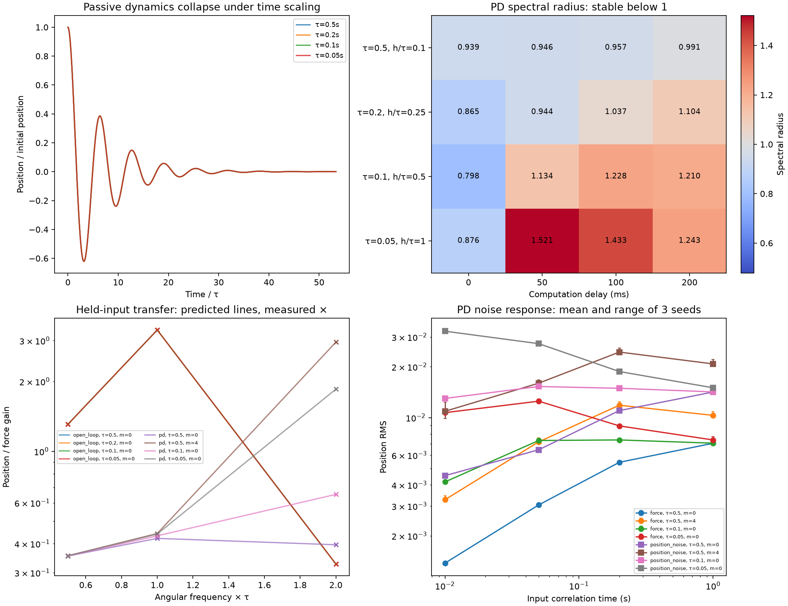

# Plant, feedback and perturbation timescales: validation results

**Complete, 8 October 2026:** 188 main simulations yielded **254/254 passing validation checks**. Four supplemental reporting-resolution simulations also passed, for **192 physical rollouts** in total. The software suite has **318 passing tests**. Five deliberately unstable simulations hit the numerical guard; their complete recorded prefixes and failure times are retained rather than scored as full-horizon runs.

The setup has the intended adjustable dynamics: plant response times span a factor of ten, delayed feedback crosses from stable to unstable, and perturbation correlation times and injection channels produce different responses in otherwise unchanged loops. This validates an environment for the next neural experiment. The controller tested here is classical PD; no transformer weights were trained or evaluated in this milestone.

The [prospective protocol](../../docs/DYNAMICS_VALIDATION.md) and [configuration](config.json) fix the parameters, checks and four supplemental cases. Sources, configuration and protocol were fingerprinted before the main simulations and stayed unchanged through validation.

## What was built and checked

The plant remains the exact normalized oscillator `tau² q'' + 2*zeta*tau q' + q = u + d`, with `zeta = 0.15` and unit static force-to-position gain. Changing `tau` changes speed without changing that static gain. The reference controller uses `u = -2*q - tau*v` from captured observations, with a fixed `50 ms` observation/dispatch period and `0, 50, 100, 200 ms` virtual computation delay. Overlapping fixed-cadence computations assume sufficient throughput.

Commands are unsaturated for these linear checks. The force clock is independently fixed at `2.5 ms`, with exact plant propagation between events. Colored disturbances are stationary OU samples held between changes. Position-measurement noise is a separate channel evaluated at each observation's capture time; velocity observations remain exact. The physical reporting trace always records true state.

| Plant tau | Passive oscillation period | Passive envelope-decay time | Update interval / tau | Maximum delay / tau |
|---:|---:|---:|---:|---:|
| 500 ms | 3.17754 s | 3.33333 s | 0.10 | 0.40 |
| 200 ms | 1.27102 s | 1.33333 s | 0.25 | 1.00 |
| 100 ms | 0.63551 s | 0.66667 s | 0.50 | 2.00 |
| 50 ms | 0.31775 s | 0.33333 s | 1.00 | 4.00 |

`tau` is inverse natural angular frequency, not the oscillation period or envelope time. At the fastest setting one update interval equals `tau`, with approximately 6.36 updates per passive oscillation. The original plant had approximately 63.6. The measured ringdowns agree with the independent scalar solutions and collapse onto the same curve when time is divided by `tau`.

## Delayed feedback reaches a stability boundary

The table gives the spectral radius of the exact augmented sampled-PD map. Values **below one are stable**; values above one are unstable for this particular unsaturated controller.

| Plant tau | 0 ms delay | 50 ms delay | 100 ms delay | 200 ms delay |
|---:|---:|---:|---:|---:|
| 500 ms | 0.939089 | 0.945706 | 0.957217 | 0.990944 |
| 200 ms | 0.865182 | 0.944346 | **1.037460** | **1.104247** |
| 100 ms | 0.798204 | **1.133626** | **1.228145** | **1.210234** |
| 50 ms | 0.875794 | **1.521273** | **1.433047** | **1.243325** |

The grid contains **eight stable and eight unstable conditions**. The fastest plant is stable with zero delay and unstable with one update of delay. At `tau = 50 ms`, `L = 50 ms`, the analytic dominant growth rate is `8.39095 /s`, and the measured log-norm slope is `8.37588 /s`. Its predicted amplitude e-folding time is about `119 ms`. Every measured growth sign agrees with the prediction; all recorded state sequences agree with the independent delayed-command recurrence.

Feedback can also introduce a long timescale. For `tau = 500 ms`, increasing delay from zero to `200 ms` changes the dominant closed-loop decay time from approximately `0.796 s` to **5.496 s**, although the passive decay time stays `3.333 s`. Thus the passive plant timescale alone does not describe the loop's temporal behavior.

Five unstable cases crossed the guard: `(tau, delay) = (100,100), (100,200), (50,50), (50,100), (50,200) ms`. The other three unstable cases completed their finite ten-second horizon from a tiny initial displacement. Completion is not evidence of asymptotic stability. The [mode records](modes.json) preserve all eigenvalues, empirical growth rates, command peaks, guard times and prefix-validation errors.

PD instability identifies demanding conditions; it does not establish that a predictive or learned controller cannot stabilize them.

## Input timescale and injection point matter independently

OU correlation times are `10, 50, 200, 1000 ms`, with marginal standard deviation `0.02` in expectation and three seeds. Traces are neither recentered nor rescaled. Each seed/timescale tape is paired across conditions. The same seed can share innovations across correlation times; these are paired comparisons, not independent inputs for every table cell.

Long-tape generator checks have at most **1.97% RMS error** and **0.0518 absolute correlation error** against their targets, within the predeclared bounds. The following values are mean true-position RMS across three 60-second simulations, scored on seconds 20–60. Full per-seed values, command effort and correlations are saved in [noise responses](noise_response.csv).

| Controller condition and injection | 10 ms correlation | 50 ms | 200 ms | 1000 ms |
|---|---:|---:|---:|---:|
| tau 500 ms, zero delay, force | 0.001378 | 0.003044 | 0.005439 | 0.007048 |
| tau 500 ms, 200 ms delay, force | 0.003269 | 0.007187 | 0.011839 | 0.010310 |
| tau 50 ms, zero delay, force | 0.010698 | 0.012507 | 0.008930 | 0.007375 |
| tau 50 ms, zero delay, position noise | 0.032448 | 0.027382 | 0.018727 | 0.015015 |

For the fastest zero-delay loop, short-correlation sensor noise yields about three times the physical position RMS of force noise with the same prescribed variance. The forcing spectrum also changes the response nonmonotonically in some fixed loops. Their analytic poles are unchanged by these additive inputs: the different statistics reflect how the loop responds to what drives it.

Force and sensor inputs pass through different paths and have different low-frequency gains; equal prescribed input variance does not imply matched effective perturbations. In particular, `10 ms` measurement noise is captured every `50 ms`, giving theoretical correlation `exp(-5) = 0.00674` between successive measurements. The runner records both fine-tape statistics and capture-grid statistics so these clocks cannot be conflated.

All 144 colored-input rollouts completed. The largest sampled absolute position was `0.12158`; the largest applied command was `0.36827`. No saturation was enabled. Passive-plant mean RMS values were between `0.914` and `1.020` times their exact stationary-covariance predictions across the tested cells. That comparison is descriptive: finite records, initial transients and averaging RMS rather than variances affect agreement. The stochastic response curves use three seeds and should not be interpreted as precise estimates of an entire spectrum.

## Numerical evidence

| Check | Worst observed discrepancy | Predeclared bound |
|---|---:|---:|
| Passive normalized state trajectory | 3.82e-15 | 1e-8 |
| Passive oscillation period | 0.01261% | 1% |
| Passive envelope-decay time | 0.00504% | 1% |
| Delayed-PD sampled state recurrence | 0 at recorded precision | 1e-8 |
| Complex sinusoidal response, including phase | 0.01287% | 0.5% |
| Colored-input captured state recurrence | 3.13e-14 | 1e-8 |
| Supplemental position RMS under finer reporting | 0.01033% | 0.5% |

The sinusoidal checks include the actual held input and sample/delay timing. Their frequencies are `omega*tau = 0.5, 1, 2`; they are checks at specified frequencies rather than a dense robustness-margin estimate. The recurrence uses the same exact plant transition but independently reconstructs the delayed control and noise sequence. The scalar passive solution separately checks physical propagation.

The [four supplemental cases](reporting_convergence.json) refine reporting from `10` to `5 ms` while keeping all physical inputs and control timing fixed. Shared-time normalized state differences remain below `4.05e-15`, shared command differences below `1.44e-15`, and exact held-action RMS changes below `2.24e-15` relatively. Refining the reporting grid does not alter the plant or input hold model.

The 318 software tests cover existing simulator behavior and the new scalar solutions, sampled transfer functions, covariance equations, OU initialization/replay, causal capture-time measurement corruption, censoring, phasor fitting and provenance guards. The main [254 check records](checks.json) and supplemental results all pass.



The noise panel shows means and ranges across three seeds, not confidence intervals. Passive traces and several passive frequency-response curves overlap under time scaling. Frequency-panel lines connect the tested points; the measured markers are independent simulation fits.

## Reproduction and retained artifacts

Use the repository's pinned scientific environment and a fresh output/artifact directory:

```bash
.venv/bin/python -m pytest -q
.venv/bin/python experiments/run_dynamics_validation.py --output runs/dynamics_reproduction/results --artifacts runs/dynamics_reproduction/artifacts
```

This experiment needs no pretrained checkpoint or PyTorch inference. [Start](start_manifest.json) and [completion](manifest.json) manifests preserve source, configuration, protocol, compact-output and large-artifact fingerprints. All original fingerprints were independently checked after the run and after the supplemental simulations. Large replayable tapes and traces remain under ignored `runs/dynamics_validation/` on the originating server; fresh runs regenerate their equivalents from the recorded parameters and seeds.

The command above reruns the 188 main simulations. The saved supplemental script records the four additional checks against the original result/artifact paths and refuses to overwrite their outcomes. To reproduce those checks on a fresh main run, use a separate copy with `OUTPUT` and `ARTIFACTS` pointed to its corresponding new directories.

- [Ringdown measurements](ringdown.csv) and [delayed modes](modes.csv).
- [Measured and predicted transfer responses](transfer.csv).
- [Individual input statistics](noise_quality_individual.csv) and [pooled generator checks](noise_quality_pooled.csv).
- [Complete colored-input outcomes](noise_response.json), including true-state scores, command peaks, capture-noise statistics and passive covariance predictions.
- [Supplemental source](reporting_convergence_check.py) and [reporting-convergence results](reporting_convergence.json), with script provenance recorded.

## Decision for the next neural experiment

The setup passes its intended dynamics checks. The next protocol should establish competent classical and learned controllers over selected plant speeds, delays and perturbation spectra before comparing suppression. Preserve the distinction between fixed-cadence latency and serial throughput, and between physical-force and measurement-noise inputs. A new transformer should be trained for the selected environment distribution; poor performance of the old single-plant checkpoints would confound temporal demands with distribution shift.

This benchmark now supports testing whether a controller changes gain, phase and damping in useful ways. It has not yet demonstrated an advantage of neural suppression, persistent recurrent state, or an E/I-inspired architecture.
