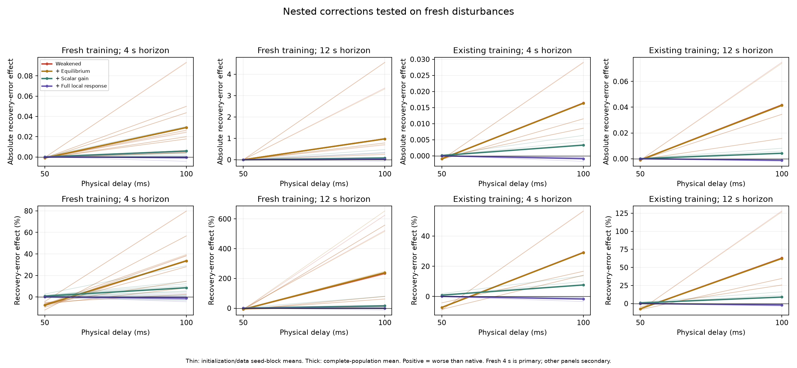
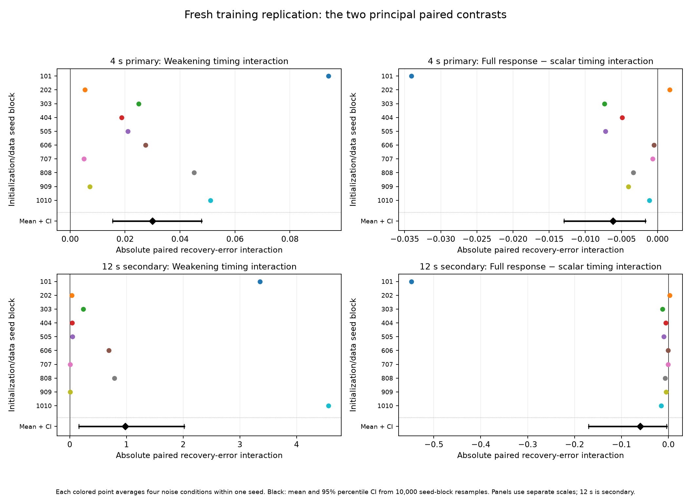
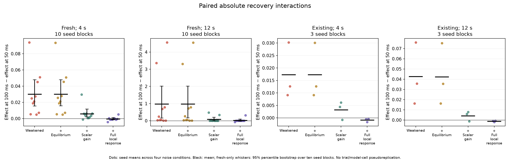
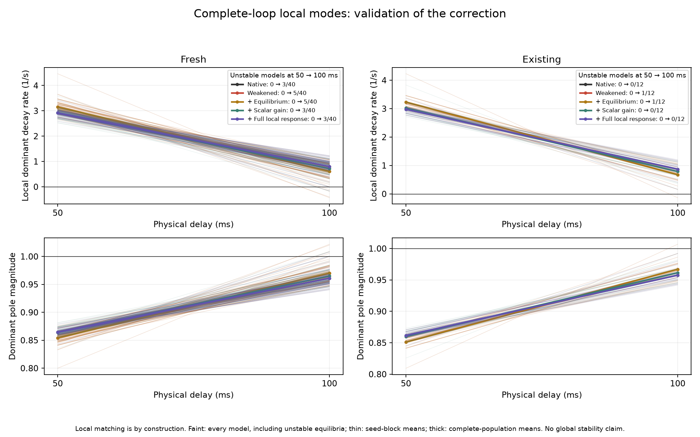
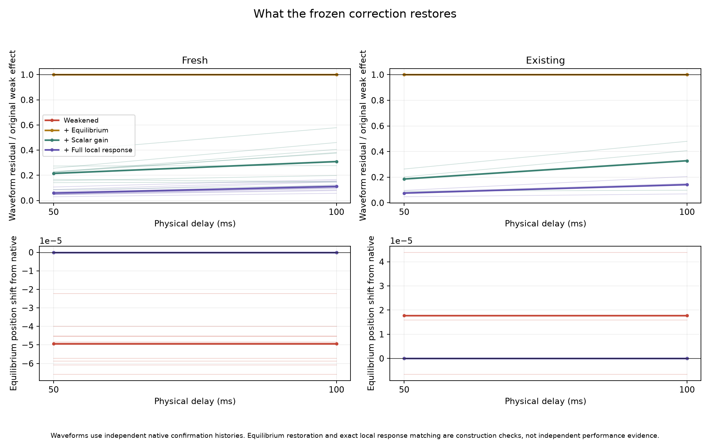
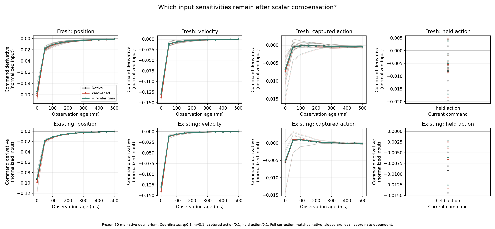
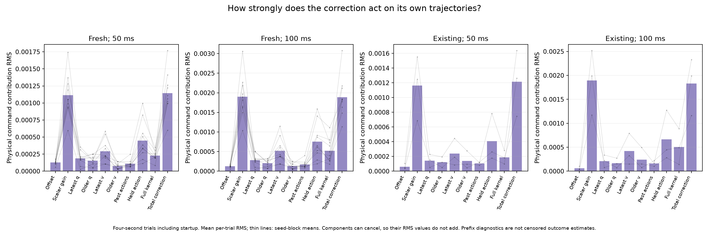
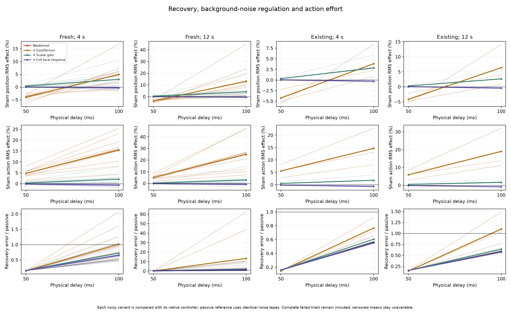

# Frozen local-response corrections and independent training replication

**The timing-dependent weakening effect replicates in freshly trained models, and restoring local feedback shape helps beyond restoring scalar gain.** In the primary four-second experiment, weakening improves recovery at 50 ms but worsens it at 100 ms in 38 of 40 new model conditions. Equilibrium restoration changes little. Scalar compensation removes much of the adverse effect; adding the complete local command-response correction brings average performance close to native. Every correction was constructed at 50 ms and transferred unchanged to 100 ms.

This supports an explanation through the local feedback law of the controller–environment system. It does not establish an inhibition-specific algorithm or cortical E/I balance. The twelve-second results expose substantial heterogeneity: some native controllers are locally unstable, and exact local matching preserves that instability. Average percentage and absolute effects can then disagree.

## Design and execution

The [protocol](../../docs/KERNEL_RESCUE.md) and [configuration](config.json) were frozen at clean commit `f3f5900`. The primary population is **40 new models: ten initialization seeds crossed with four noise correlation times**. Each model received independent training and validation demonstrations. Architecture, teacher, optimizer, fifty-epoch budget and validation-error checkpoint selection are unchanged. The twelve inherited models provide a separate exploratory bridge to previous findings.

Each controller is a two-block, four-head transformer with width 32 and 17,889 parameters. It controls the normalized 200 ms mass–spring–damper plant using eleven observation tokens spanning 0.5 s. Observation and decision cadence remain 50 ms. Physical command latency is 50 or 100 ms, while the planned-delay input remains 50 ms. Both latencies share the same action-age phase at mature dispatch. The idealized pipeline keeps cadence fixed even when commands take two decision periods to arrive.

All forty fresh models met the inherited branch-selection rule on independent discovery histories; groups contained one to seven of the ten tested attention-head/MLP branches. This establishes functional suppression under that assay. It does not show that suppression originated during training: this experiment did not compare fresh initial and trained checkpoints for emergence. All models and all fits remained available.

| Stage | Records | Physical trials/checks |
|---|---:|---:|
| New common discovery bank | 1 | 10 |
| Fresh training/validation demonstrations | 40 models | 880 |
| Fresh weak-offset calibration | 40 | 240 |
| Correction calibration at 50 ms | 52 | 312 |
| Passive references | 8 | 96 |
| Five-policy confirmation, two delays and two horizons | 208 | 12,480 |
| Complete-loop simulator parity | 104, containing 520 variants | 520 |
| **Total** | | **14,538** |

All 13,128 offset-calibration, correction-calibration, passive-reference and confirmation trials completed without task failure or censoring. All 520 simulator checks passed. The 880 demonstrations, ten discovery-bank trials and 2,080 separately calculated deterministic map trajectories are accounted for separately; map trajectories do not add to the physical-trial total. Development runs are excluded.

## What the nested corrections change

Let `h*` be the native equilibrium history and `u*` its command. The accessible vector `h` contains normalized positions, velocities and captured/held actions, without pending commands. Let `f_w` denote the weak policy's pre-clipping command, and `K_n`, `K_w` its native/weak local derivatives at `h*`.

| Variant | Pre-clipping command |
|---|---|
| Native | Unmodified trained policy |
| Weakened | Selected suppressive branches scaled by 0.9, with frozen inherited/base offset |
| + Equilibrium | `u* + f_w(h) − f_w(h*)` |
| + Scalar gain | `u* + g [f_w(h) − f_w(h*)]` |
| + Full local response | Previous command plus `(K_n − g K_w)(h − h*)` |

The scalar `g` fits pulse-minus-sham command waveforms on independent native histories at 50 ms. It is not fitted to recovery error. All 52 preparations were sealed before confirmation; coefficients, anchor and gain remain identical at both delays and both horizons. Gains ranged from 0.88184 to 0.97311, with no bound hits. At startup, the correction uses only the available observation suffix. It receives no future information or hidden simulator state.

## Primary result: fresh models, four seconds

Recovery error is the amplitude-normalized integral of squared pulse-minus-own-sham position, scored from pulse onset at 1 s to the horizon. It is a position-error integral, not mechanical energy. Negative effects improve recovery relative to native. Percentage entries below are means of forty within-model percentages; they are not percentages of a pooled error total.

| Policy | Effect at 50 ms | Effect at 100 ms |
|---|---:|---:|
| Weakened | −7.43% | +33.52% |
| + Equilibrium | −7.42% | +33.62% |
| + Scalar gain | +0.80% | +8.57% |
| + Full local response | +0.14% | −0.96% |

Weakening improves recovery at 50 ms in all forty models and worsens it at 100 ms in 38/40. At 100 ms its median effect is +18.85%, with range −7.40% to +182.64%. The complete correction improves upon scalar compensation in **33/40 models and 9/10 initialization blocks**. Its own effect relative to native ranges from −7.30% to +9.25%, so a near-zero population mean is not uniform restoration.



Define `D_v(L) = E_v(L) − E_native(L)` and the paired timing interaction `I_v = D_v(100 ms) − D_v(50 ms)`. The primary analysis uses these **absolute** differences. Average the four noise conditions within an initialization seed, then analyze the ten seed-block means. The intervals below are descriptive 95% percentile intervals from 10,000 whole-block bootstrap resamples; they condition on the task grid and shared probe tapes and are not multiplicity-adjusted tests.

| Fresh four-second contrast | Mean absolute interaction | 95% seed-block interval |
|---|---:|---:|
| **Weakening, first principal estimate** | **+0.0299942** | **[+0.0155095, +0.0478737]** |
| **Full local correction minus scalar, second principal estimate** | **−0.00614869** | **[−0.0129215, −0.00168507]** |
| Equilibrium minus weakening | +0.00004293 | [−0.00013488, +0.00021962] |
| Scalar minus equilibrium | −0.0242830 | [−0.0370198, −0.0131446] |
| Full local correction minus native | −0.00039455 | [−0.00167461, +0.00113533] |

All ten seed-block weakening interactions are positive; nine of ten full-minus-scalar interactions are negative. The final interval crossing zero does **not** establish equivalence to native. Nor can these nested intervention differences be interpreted as causal percentages mediated by gain or history: the policies change their own trajectories, and the compensation objectives differ.





The twelve existing models give the same qualitative pattern on new probe streams: weakening changes from −7.26% to +29.13%; scalar compensation from +0.90% to +7.63%; the complete correction from +0.05% to −1.68%. All twelve weakening interactions are positive. Their mean absolute weakening interaction is +0.0173305 and complete-minus-scalar interaction is −0.00411882. These three-seed results are descriptive, separate from the fresh replication.

## Local dynamics and what their restoration means

The complete state map contains observation/action history, held action and the pending command pipeline: 34 coordinates at 50 ms and 35 at 100 ms. Jacobians use a float64 smooth extension of the trained weights; physical rollouts retain float32 inference, with the parity checks reported below. A larger positive dominant decay rate means faster local asymptotic decay; negative rates indicate local instability.

| Fresh policy | Mean decay at 50 ms | Mean decay at 100 ms | Stable at 100 ms |
|---|---:|---:|---:|
| Native | 2.917 /s | 0.798 /s | 37/40 |
| Weakened | 3.151 /s | 0.609 /s | 35/40 |
| + Equilibrium | 3.150 /s | 0.608 /s | 35/40 |
| + Scalar gain | 2.926 /s | 0.715 /s | 37/40 |
| + Full local response | 2.917 /s | 0.798 /s | 37/40 |

All fresh policies are locally stable at 50 ms. Weakening increases decay there in 37/40 models and decreases it at 100 ms in 38/40. All twelve existing models show that decay reversal. These measurements connect the recovery effect to actual controller–plant dynamics.

The full correction restores the native command derivative and augmented Jacobian **by construction**. Maximum discrepancies are `8.33e-17` and `1.12e-15`, respectively. This is an implementation check, not independent support for a discovered mechanism. The empirical evidence is that the correction also helps on independent, finite, noisy trajectories at the uncalibrated latency.



At 100 ms, three fresh native models—seeds 101, 202 and 1010, each in the 1 s noise condition—have locally unstable equilibria. The full correction necessarily preserves those local modes. Passing a finite-horizon task threshold is not a guarantee of asymptotic stability. Full spectra, tiny-probe validation and finite nonlinear map responses remain in `mechanism/`; unstable cases are retained in all summaries.

## Twelve seconds: a meaningful limit on generalization

The longer horizon shares the first four seconds of each noise tape and is a secondary analysis, not an independent replication. At 100 ms, fresh weakening has mean effect **+234.99%**, but median **+22.19%**, with a range from −7.43% to +2461.13%. A few poorly damped or unstable conditions dominate the mean.

| Fresh policy at 100 ms, twelve seconds | Mean absolute error change | Mean within-model percentage | Median percentage |
|---|---:|---:|---:|
| Weakened | +0.977076 | +234.99% | +22.19% |
| + Scalar gain | +0.0840964 | +16.07% | +7.31% |
| + Full local response | **+0.0238895** | **−0.70%** | −0.60% |

The complete correction still improves on scalar compensation in 33/40 models and 9/10 seed blocks. Its incremental timing interaction is −0.0601225, with descriptive interval [−0.169682, −0.00333693]. However, its mean **absolute** error remains worse than native at 100 ms, despite the slightly favorable mean percentage. These quantities weight models differently through their native denominators.

The largest adverse complete-correction case is seed 1010, noise correlation time 1 s: +1.28516 absolute error, or +63.47% versus native. The complete-correction residual timing interaction is +0.0238721 with interval [−0.0226899, +0.0958062]. A local match therefore does not imply long-horizon nonlinear equivalence or a robust stability repair.

## Matching quality, input contributions and task tradeoffs

On fresh four-second native confirmation histories at 100 ms, scalar compensation leaves mean waveform error equal to 2.36% of the native response, or 30.92% of the original weak-minus-native difference. The complete correction reduces those values to 0.83% and 11.15%. Matching transfers imperfectly away from the anchor, even when local derivatives are exact.



The residual correction includes current position, current velocity, held action and older observations. In the declared normalized coordinates, the fresh mean squared-norm allocations are approximately 26.6% latest position, 27.9% latest velocity, 30.4% held action and 15.0% the remaining history coordinates. These allocations depend on units and correlated inputs; they are descriptive, not causal shares. A non-scalar correction cannot automatically be called a memory mechanism. Its components have not been separately ablated.



Own-trajectory diagnostics record each correction component, warmup decisions and clipping, separately for every physical pulse/sham trial. These are actual corrected-policy histories, not only calibration histories. Correlated component RMS values need not add to the RMS of their sum.



For fresh four-second trials at 100 ms, weakening increases sham position RMS by 4.89% and action RMS by 15.47%. Scalar compensation leaves increases of 3.03% and 2.09%; the complete correction gives −0.30% and −0.61%. Thus its recovery improvement does not conceal a population-average noise-regulation or effort penalty in this condition.

Native sham RMS beats passive motion in all forty fresh models at both delays and horizons. Native recovery beats passive motion in 40/40 at 50 ms and 34/40 at 100 ms. At 100 ms its twelve-second mean recovery/passive ratio is 1.454 despite a median of 0.463, another indication of the difficult tail. Absence of task failures should not be substituted for comparison with passive motion.



## Interpretation and next experiment

The independent replication strengthens the claim that the functional contribution of these selected suppressive pathways depends on feedback timing. The correction sequence narrows the explanation: equilibrium shifts account for little here, overall response gain accounts for much, and restoring local feedback shape provides an additional benefit. That shape includes the relative sensitivities to position, velocity and actions as well as older observations.

This remains a targeted 200 ms plant regime selected after earlier exploratory work. The broader grid's mixed results remain in the [delay report](../delay_sweep/README.md). Models were trained by teacher imitation, with virtual latency and idealized pipeline throughput. No matched non-transformer replication, direct closed-loop learning or explicit E/I-inspired architecture has yet been tested here.

The next discriminating experiment is to separate current position/velocity, held action and older-history terms of the correction, with matched controls and fresh confirmation streams. That would identify which part of the feedback shape provides the added benefit. A subsequent training-delay × test-delay experiment would address adaptation of suppression during learning; this experiment primarily tests the usefulness of already identified pathways. The unstable tail should remain an explicit target rather than being removed from the population.

## Verification and reproduction

The software suite passed **736 tests**. Independent audits reconstructed 52 scalar fits and 74,880 corrected command samples; 520 physical augmented matrices and 3,640 frequency responses; 50,160 summary/delta calculations; and paired model-to-seed aggregation with 10,000-resample bootstrap intervals. Arithmetic discrepancies were at floating-point precision. All 160 fresh checkpoint payloads and eighty independent demonstration-stream families were checked, including exact validation-MSE checkpoint selection.

All 15,600 mature simulator steps matched the complete map within `3.91e-7` normalized state and `3.91e-8` physical command. Tiny-probe relative error over the first half-second was at most `1.97e-6`. These local validation probes are distinct from finite-disturbance and long-horizon performance.

The run seals 32 scientific sources and 697 artifacts and verifies all four ancestor inventories. See [execution accounting](execution_audit.json), [training/provenance audit](validation_training_provenance.json), [calibration/dynamics audit](validation_calibration_mechanism.json), [inference audit](validation_inference.json), [validation summary](validation.json), [publication hashes](artifact_manifest.json), and the retained [audit scripts](audit_scripts/). The [descriptive findings](mechanistic_findings.json) and [summary](summary.json) retain ranges, medians, failures and seed-block intervals.

Eight PNG/SVG plot pairs are in [plots/](plots/). CSVs retain [model metrics](model_metrics.csv), [population metrics](population_metrics.csv), [model interactions](model_interactions.csv), [seed interactions](seed_interactions.csv), [seed metrics](seed_metrics.csv), [kernel coefficients](kernel_coefficients.csv), [kernel component summaries](kernel_components.csv) and [own-history diagnostics](own_history_corrections.csv). Raw preparations, confirmations, passive references, mechanisms, training records and discovery results remain in their named subdirectories.

```bash
.venv/bin/python experiments/run_kernel_rescue.py --output runs/kernel_reproduction/results --artifacts runs/kernel_reproduction/artifacts
.venv/bin/python experiments/plot_kernel_rescue.py --results runs/kernel_reproduction/results
```

Launch from clean committed scientific sources into fresh empty directories. Historical artifacts under `runs/` are required for lineage verification and the existing population. Fresh demonstration data and initial/intermediate/final/selected checkpoints are retained on this server under `runs/kernel_rescue/`, with their hashes published. They are not embedded in Git. The production log is `runs/kernel_rescue.log`. Plotting does not rerun or retune the experiment.
