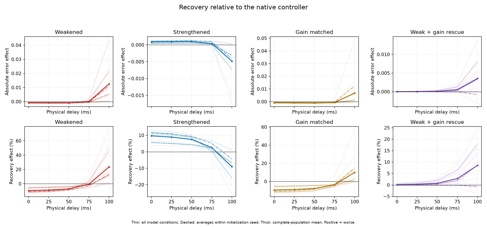
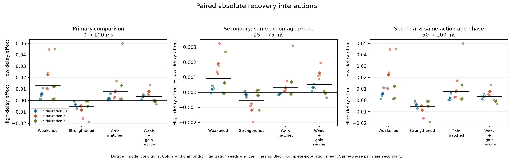
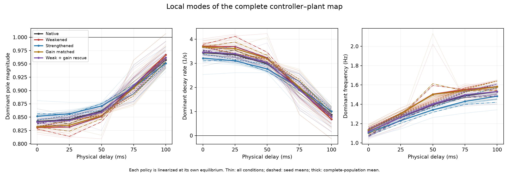
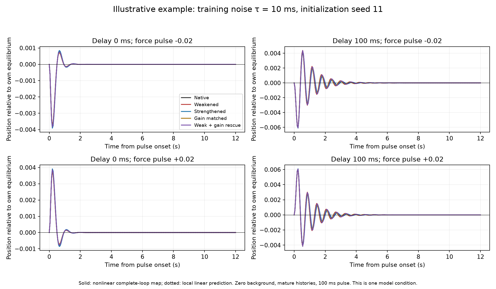
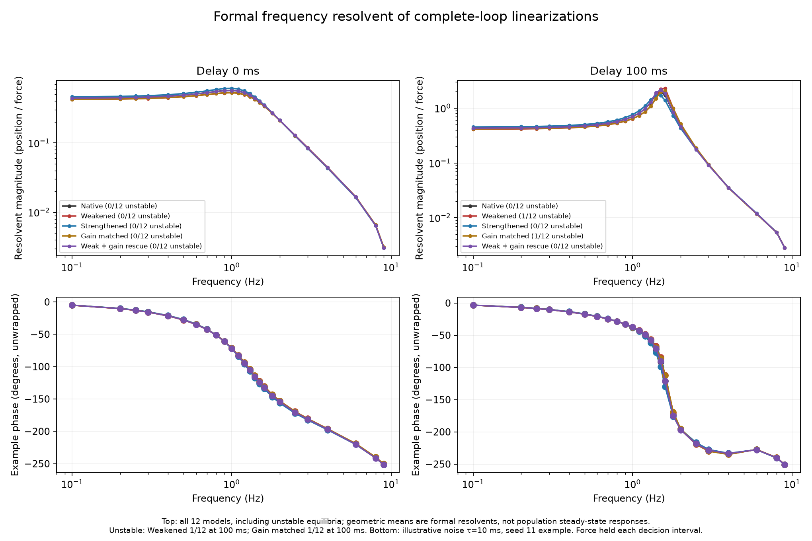
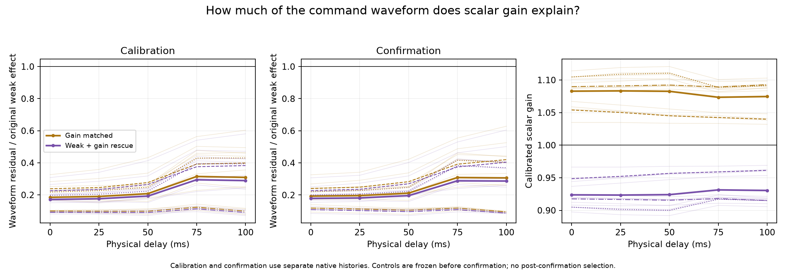
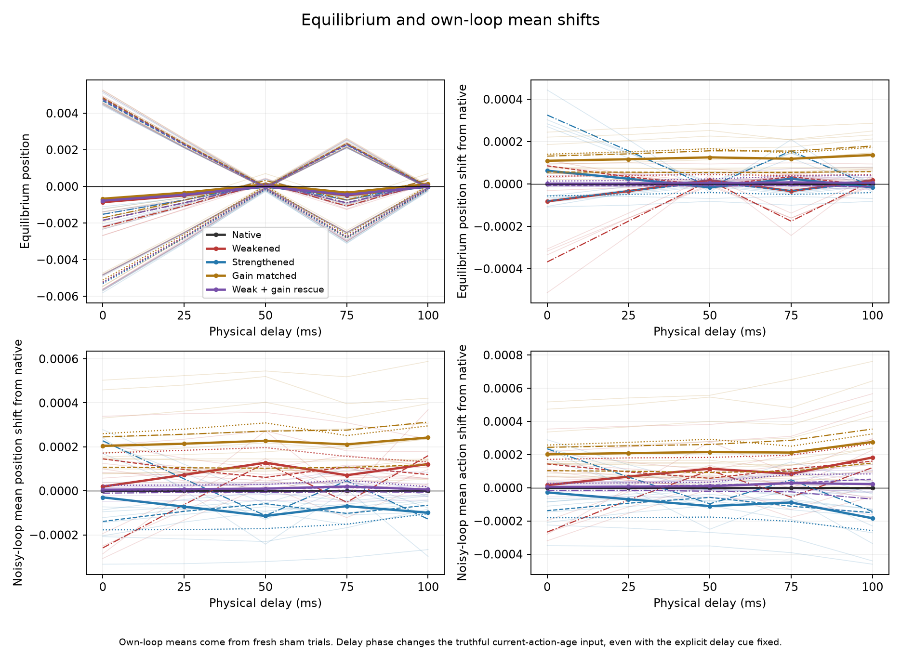

# Complete-loop dynamics and gain rescue

The timing crossover now has a directly measured dynamical counterpart: weakening the selected suppressive pathways **speeds local decay at zero delay but slows it at 100 ms, in all 12 existing controllers**. A calibrated gain-and-mean compensation removes much of the recovery effect, but leaves a smaller, heterogeneous residual. This supports a contribution through feedback gain and damping; it does not establish an inhibition-specific algorithm.

This targeted follow-up uses the 200 ms plant selected from the [previous delay sweep](../delay_sweep/README.md). It keeps all twelve saved model conditions: three initialization seeds, each trained in four noise conditions. There is no retraining or new pathway discovery. Fresh disturbances provide a new probe replication on these weights, not independent training replication. The broader preceding experiment's negative pooled absolute interaction remains part of the evidence.

## What ran

The [protocol](../../docs/LOOP_MECHANISM.md) and [configuration](config.json) were frozen at commit `681c088`. All 60 model × delay calibrations were sealed before confirmation. Delays are 0, 25, 50, 75 and 100 ms; observation and decision cadence remains 50 ms; the planned-delay cue remains 50 ms. The controller still receives truthful observation and applied-action histories.

Five variants were tested: native, inherited joint weakening by 10%, inherited joint strengthening by 10%, a separately fitted scalar gain control, and weakened branches with a separately fitted gain-and-mean rescue. The last two fit the complete pulse-minus-sham command waveform on native calibration histories, with a separate clipped sham-mean correction. They are frozen during confirmation.

| Stage | Records | Physical trials |
|---|---:|---:|
| Independent native-history calibration | 60 | 360 |
| Five-variant noisy confirmation | 60 | 3,600 |
| Shared passive reference | 4 | 48 |
| Event-simulator checks of complete-loop maps | 60, containing 300 variants | 300 |
| **Total** | | **4,308** |

All 4,008 stochastic trials completed without task failure or censoring. All 300 simulator checks passed. Separately, 1,800 deterministic nonlinear-map pulse traces were computed; these are map analyses, not additional event-simulator trials. Development runs are excluded from every research total and summary.

## Recovery crossover and partial rescue

Each entry below averages the twelve within-model percentage effects on amplitude-normalized integrated squared pulse-minus-own-sham position. Negative values improve recovery; positive values worsen it. This is a position-error integral, not mechanical energy.

| Delay | Weakened | Strengthened | Gain matched | Weak + gain/mean rescue |
|---|---:|---:|---:|---:|
| 0 ms | −9.57% | +9.67% | −9.44% | +0.13% |
| 25 ms | −8.75% | +8.90% | −8.87% | +0.33% |
| 50 ms | −7.13% | +7.48% | −7.79% | +0.75% |
| 75 ms | −0.61% | +2.51% | −3.79% | +2.78% |
| 100 ms | +23.54% | −8.98% | +9.99% | +8.54% |

Weakening switches from helpful to harmful in **12/12** controllers. The scalar control also crosses over in **9/12**. Compensation brings the weakened policy close to native recovery at zero delay. At 100 ms it improves recovery relative to uncompensated weakening in **10/12**, but remains worse than native in **10/12**. It is a partial rescue.



The primary measure is the **absolute** within-model interaction, `(E_variant(100 ms) − E_native(100 ms)) − (E_variant(0) − E_native(0))`, computed before averaging. The percentage interaction is secondary.

| Variant | Mean absolute interaction | Mean percentage-point interaction | Positive absolute interactions |
|---|---:|---:|---:|
| Weakened | +0.01344317 | +33.1054 pp | 12/12 |
| Strengthened | −0.00571676 | −18.6529 pp | 0/12 |
| Gain matched | +0.00761345 | +19.4281 pp | 12/12 |
| Weak + gain/mean rescue | +0.00352923 | +8.4106 pp | 10/12 |

The rescue-minus-weak absolute interaction is negative in all twelve models. This reduction is not a causal fraction mediated by gain: compensation changes gain and offset, matching is imperfect, and the control's own histories change. The remaining rescue interaction is positive when averaged within initialization seeds 11 and 22, but negative for seed 33: +0.00335074, +0.00798671 and −0.00074977 respectively. All model values and initialization-seed averages remain visible.



## The complete loop changes its damping

The state map includes eleven observations, their captured actions, the currently held command and every pending command. It has 34 coordinates for delays through 50 ms and 35 for 75/100 ms. Each variant is linearized at its own disturbance-free equilibrium. The largest pole magnitude determines the local asymptotic decay/growth rate, `−log(rho)/0.05`; larger positive rates mean faster decay.

| Variant | Mean dominant decay rate at 0 ms | At 100 ms | Locally stable at 100 ms |
|---|---:|---:|---:|
| Native | 3.438 /s | 0.870 /s | 12/12 |
| Weakened | 3.713 /s | 0.676 /s | 11/12 |
| Strengthened | 3.213 /s | 1.007 /s | 12/12 |
| Gain matched | 3.677 /s | 0.787 /s | 11/12 |
| Weak + gain/mean rescue | 3.462 /s | 0.778 /s | 12/12 |

Weakening increases decay relative to native at zero delay in **12/12**, and decreases it at 100 ms in **12/12**. Strengthening reverses both signs in every model. Mean dominant pole magnitudes change from 0.8421 to 0.9576 for native and from 0.8306 to 0.9670 for weakened policies. These are averages of individual poles' magnitudes, not the spectrum of an averaged controller.

At 100 ms, the model trained with noise correlation time 1 s and initialization seed 33 has a locally unstable equilibrium under weakening (`rho=1.006790`) and under the scalar control (`rho=1.006627`). Native and rescued equilibria remain locally stable. This does not contradict the absence of failures in four-second noisy trials: a finite task threshold and local asymptotic stability are different tests. Neither unstable large-pulse response settles to the declared 2% band within twelve seconds.



The nonlinear ring-down plot below uses an illustrative example: noise correlation time 10 ms, seed 11, both ±0.02 pulse signs. Every variant starts at its own equilibrium with a mature history. These zero-background trajectories have a different starting condition and horizon from the noisy task trials. All 1,800 traces, including unsettled cases and their full-horizon linear discrepancies, remain in the raw mechanism records.

At 100 ms the twelve-model mean ±0.02 ring-down error effect is +115.1% for weakening, while the median is +20.3%; the unstable model dominates the mean. Do not equate this twelve-second equilibrium response with the four-second noisy effect of +23.54%. Rescue leaves a mean +10.63% ring-down error, close to its infinitesimal linear prediction of +10.64%. Its residual therefore also appears in local loop dynamics. At 100 ms rescue nearly restores the dominant oscillation frequency (native 1.5311 Hz, rescue 1.5314 Hz, weakened 1.5820 Hz), while restoring decay only partly. See the [complete population findings](mechanistic_findings.json).



The frequency calculation uses external force held over each 50 ms decision interval and position sampled at decision instants. It concerns the complete feedback map. For stable equilibria it gives the local steady-state disturbance response. For the two unstable policy instances, the finite resolvent remains a mathematical calculation without a stable steady-state interpretation; the full-population plot explicitly retains and labels these instances. It is not a continuous sinusoidal-force experiment or an open-loop gain/phase-margin measurement.



## What scalar compensation does and does not match

All 120 control fits were available; none reached the gain bounds. Gain-matched settings ranged from 1.03195 to 1.12061, and rescue gains from 0.89192 to 0.96898.

On independent native confirmation histories, the rescue's RMS waveform discrepancy relative to the native pulse response averages **1.50% at zero delay** and **2.14% at 100 ms**. Relative to the original weak-minus-native waveform difference, the remaining discrepancy is larger: **17.85% and 28.69%**. Thus close agreement relative to the whole command response does not imply removal of the intervention itself. The residual can still matter in a loop with slow decay.

Mean absolute residual sham-command drift is 0.0000434 at zero delay and 0.0000874 at 100 ms. Mean signed drifts are smaller because different model conditions cancel. Rescue also changes the equilibrium: maximum absolute position shifts from native are 0.0000407 and 0.0000794 at these endpoints. These checks constrain a mean-shift explanation but do not eliminate it; no offset-only control has been performed.



## Timing-input phase and task tradeoffs

The current-action-age feature is 50 ms at zero latency, 25 ms at latencies 25/75 ms, and zero at latencies 50/100 ms. Capture precedes a same-time completion-generated application, while dispatch sees the newly applied command. Preserving this event order is essential for matching the original model inputs. This truthful age feature can shift the equilibrium even when the separate planned-delay cue is fixed.

The prespecified secondary 50→100 ms comparison keeps this action-age phase the same. Each inherited native/weak/strong policy also has exactly the same computed equilibrium at both delays. Weakening changes from −7.13% to +23.54%; all twelve absolute interactions are positive, with mean +0.01350589, and the local decay effect reverses in all twelve. The crossover therefore does not require the equilibrium shift seen between zero and positive integer delays. The 25→75 ms comparison is weaker and heterogeneous: mean absolute interaction +0.00092076, positive in 8/12. These comparisons were declared following development checks and before production confirmation; they remain secondary.



Recovery and noise regulation are not interchangeable. At 100 ms, weakening changes sham position RMS by −0.53% and effort by +9.32%; the rescue changes them by +2.37% and +2.61% relative to native. The rescue's recovery benefit over weakening therefore has a noise-regulation tradeoff. The scalar control changes sham position RMS by −3.09% and effort by +6.25%.

Native sham position RMS beats passive motion in all twelve models at both primary endpoints, with mean native/passive ratios 0.480 and 0.605. Native pulse-recovery error beats passive motion in 12/12 at zero delay and 11/12 at 100 ms. No failure-threshold crossing should be treated as proof of superiority to the passive reference.

## Interpretation and next discriminating test

The findings connect functional suppression to timing-dependent **gain and damping of the actual controller–environment loop**. In this selected regime, weaker suppression gives faster decay without latency, but slower decay at 100 ms, reaching local instability in one condition; strengthening gives the opposite effect. A scalar gain change reproduces much of that pattern, and compensating gain and mean partially restores native behavior.

The remaining effect could involve history-dependent response shape, state-dependent nonlinear gain, residual mean changes, and amplification of imperfect matching near weakly damped modes. These measurements do not distinguish those possibilities completely. They do not establish a cortical E/I-balanced regime, transformer specificity, global nonlinear stability or an architectural advantage.

The next useful steps are an independent training replication of this focused contrast and a gain-versus-offset factorial control. To isolate the remaining temporal component, compare the complete controller response kernels after scalar compensation and test a kernel-matched dynamic control on separate calibration/confirmation data. Training-delay × deployment-delay experiments would then test emergence rather than only usefulness of already selected pathways.

## Verification and reproduction

The software suite passes **612 tests**. Independent arithmetic checks recomputed 120 gain fits, 600 fixed-history variant assays, all paired trial means/deltas and waveform diagnostics: 89,520 comparisons, maximum absolute discrepancy below `1e-15`. An independent event-phase derivation reconstructs all 300 augmented Jacobians from physical plant exponentials, the saved policy derivatives and explicit queue/history shifts, agreeing within `1.2e-15`. It also checks poles, resolvents, all linear pulse trajectories and recorded transient metrics.

All 9,000 mature simulator steps agree with the full map within `3.10e-7` normalized state and `3.10e-8` physical command units. The largest first-half-second relative error on the ±0.000001 linearization probes is `1.305e-6`, below the frozen 1% tolerance. This short local check is distinct from the stored twelve-second nonlinear discrepancies.

Provenance verifies 29 scientific sources and 187 sealed artifacts for this run, plus the preceding delay inventory (26/354), collective inventory (24/250) and training inventory (21/422). All scientific bytes match the clean launch commit. See [execution accounting](execution_audit.json), [gain/confirmation arithmetic audit](rescue_audit.json), [dynamics audit](dynamics_audit.json), [provenance audit](provenance_audit.json), [validation record](validation.json), [publication hashes](artifact_manifest.json) and the independent [audit scripts](audit_scripts/) used on this server.

The [plots](plots/) contain seven PNG/SVG figure pairs. [Model metrics](model_metrics.csv), [model interactions](model_interactions.csv), [seed metrics](seed_metrics.csv), [seed interactions](seed_interactions.csv) and [frequency metrics](frequency_metrics.csv) retain the underlying values. `prepare/`, `confirm/`, `mechanism/` and `passive/` contain the sealed records; `summary.json` and `plot_manifest.json` describe the derived tables and their inputs.

Reproduce with the original hash-verified checkpoints and historical artifacts retained on this server:

```bash
.venv/bin/python experiments/run_loop_mechanism.py --output runs/loop_mechanism_reproduction
.venv/bin/python experiments/plot_loop_mechanism.py --results runs/loop_mechanism_reproduction
```

Use a new empty directory and clean committed scientific sources. A fresh clone additionally requires the historical checkpoint/data artifacts under `runs/`; newly trained weights are a different experiment. The runner refuses altered completed results and changed scientific inputs on resume. Plotting does not rerun or retune the experiment. The production log is `runs/loop_mechanism.log`.
