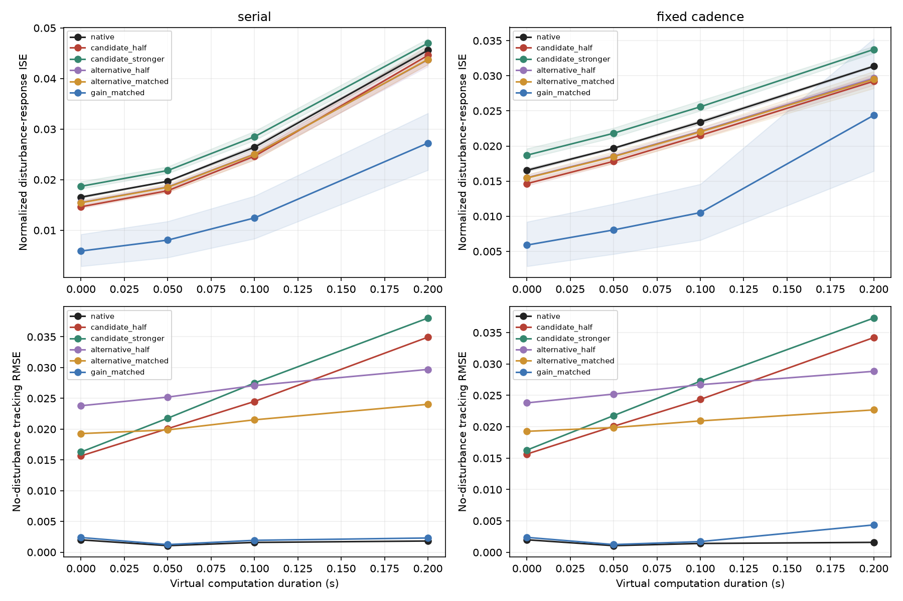

# First causal suppression experiment

Completed 7 October 2026. This pilot tests the functional role of attention-head contributions in the three already trained transformer controllers. It changes frozen head contributions and measures the resulting controller–plant behavior; it does not train an E/I architecture or test emergence under different training pressures.

**Finding:** functionally suppressive contributions replicated in all three models, while the proposed consistent benefit under faster temporal demands was not established. Halving the selected head lowered mean incremental disturbance-response error in 23 of 24 seed × timing conditions, but introduced autonomous drift and caused competence failures in one seed at the longest delay. The primary temporal contrast had different signs across seeds. Poor per-condition control matching further limits mechanistic specificity.

## Frozen design

The [protocol](../../docs/SUPPRESSION_PILOT.md) and [configuration](config.json) were specified before discovery and confirmation. Eight discovery scenarios selected at most one head per model at fixed-cadence computation delay 0.05 s. Four independent calibration scenarios checked replication, native control competence and matched control strengths. Eight new confirmation scenarios evaluated all frozen variants at four computation delays and both timing schedules.

Each five-second episode starts at zero state and zero reference. A signed disturbance of magnitude 0.3–0.6 lasts 0.25 s, starting between 1.0 and 1.4 s. Every pulse run has a paired zero-disturbance run under the same intervention. Sensing and fixed-cadence dispatch use 0.05 s intervals; reporting uses 0.01 s. Delays are prescribed virtual computation durations, independent of measured CPU runtime.

The normalized recovery endpoint is `J = integral[(q_pulse - q_sham)^2 dt] / amplitude^2` over the three seconds after pulse offset. Absolute pulse and sham behavior are scored separately to prevent subtraction from hiding controller drift. With the declared plant units, J has units of seconds.

The confirmation run contains **1,216 pulse/sham pairs, or 2,432 rollouts**, with 0 censored pairs. Native competence passed 24 of 24 seed × timing checks in confirmation (24/24 had passed before confirmation on calibration). This is a three-model feasibility experiment, without a population-level architectural claim.

## Candidate discovery and independent replication

The intervention scales only one head’s columns in the attention output projection. Its shared bias, attention computation and downstream network remain intact. Discovery measures how halving this contribution changes RMS disturbance-evoked, physically clipped commands on paired fixed native histories. The rule requires median increase above 5% and a positive increase in at least 75% of scenarios.

| Training seed | Candidate layer/head (zero-based) | Discovery increase | Calibration increase | Alternative layer/head | Alternative/candidate residual RMS | Alternative discovery increase |
|---|---|---:|---:|---|---:|---:|
| 11 | 1/1 | 8.96% | 9.04% | 1/0 | 0.817 | 6.23% |
| 22 | 1/1 | 12.60% | 12.82% | 1/0 | 0.710 | 4.82% |
| 33 | 1/3 | 8.49% | 8.40% | 1/1 | 1.139 | 5.11% |

All selected heads increased the response on every discovery and same-timing calibration scenario when weakened. These are operationally suppressive contributions on this task distribution, not a classification of inhibitory neurons or evidence of E/I balance. Alternative heads were selected by residual norm in the same layer; some also satisfy the suppression rule, so they are not nonsuppressive nulls.

## Held-out temporal effects

The upper panels show normalized incremental disturbance-response error; the lower panels show absolute tracking error without a disturbance. Lines average model-seed means; shaded upper bands are the minimum and maximum seed means, not confidence intervals. Serial and fixed-cadence schedules are kept separate.

The primary contrast for each model is `(J_half - J_native) at 0.2 s minus (J_half - J_native) at 0 s`, using fixed-cadence inference. A positive value means weakening the selected contribution is more damaging to the incremental disturbance response at the longer delay. The other columns use the same contrast for their own intervention.

| Seed | Schedule | Candidate half | Candidate stronger | Alternative half | Alternative calibrated | Gain calibrated |
|---:|---|---:|---:|---:|---:|---:|
| 11 | fixed_cadence | -0.000734 | +0.000662 | -0.000797 | -0.000245 | -0.002703 |
| 11 | serial | -0.000574 | +0.000361 | -0.001393 | -0.000423 | -0.004772 |
| 22 | fixed_cadence | -0.000127 | +0.000106 | -0.000457 | -0.000544 | +0.017942 |
| 22 | serial | +0.001021 | -0.000852 | -0.000430 | -0.000515 | -0.010080 |
| 33 | fixed_cadence | +0.000174 | -0.000050 | -0.000766 | -0.001504 | -0.004240 |
| 33 | serial | +0.002271 | -0.001773 | -0.000620 | -0.001165 | -0.008202 |

All eight paired scenario contrasts per model/variant are retained in [interactions.json](interactions.json). [interaction_controls.csv](interaction_controls.csv) includes candidate-minus-control temporal contrasts; these are descriptive comparisons, subject to the matching limits below. Middle delays, strengthened heads and serial scheduling are secondary analyses.

In the primary fixed-cadence comparison, weakening improved the incremental response score more at 0.2 s than at zero delay for seeds 11 and 22. For seed 33 it improved that score less at 0.2 s; its positive interaction does **not** mean weakening raised J above native control. Across conditions and seeds, mean J fell from 0.024904 to 0.023111 (about 7.2%), while mean sham tracking RMSE rose from 0.00156 to 0.02368. This tradeoff prevents describing the lesion as an overall control improvement.

Those primary statements concern fixed-cadence inference. In the secondary serial condition, seed 33 at 0.2 s was the one cell where weakening increased mean J above native control, by 0.000743. The dependence on schedule reinforces why latency and decision cadence cannot be pooled into one claim.

| Variant | Pulse/sham pairs | Absolute competence failures | Mean response J | Mean sham tracking RMSE | Maximum sham tracking RMSE |
|---|---:|---:|---:|---:|---:|
| alternative_half | 192 | 0 | 0.023579 | 0.02629 | 0.04170 |
| alternative_matched | 192 | 16 | 0.023520 | 0.02093 | 0.04926 |
| candidate_half | 192 | 16 | 0.023111 | 0.02368 | 0.06093 |
| candidate_stronger | 192 | 16 | 0.026979 | 0.02578 | 0.06464 |
| gain_matched | 192 | 8 | 0.012809 | 0.00219 | 0.00950 |
| native | 192 | 0 | 0.024904 | 0.00156 | 0.00311 |
| teacher | 64 | 0 | 0.024854 | 0.00000 | 0.00000 |

Mean pulse action effort was 0.02539 for native control, 0.03410 for the weakened candidate, 0.02808 for the strengthened candidate and 0.72608 for the gain control. The gain control's lower aggregate response J comes with much greater effort and a competence failure at the longest fixed-cadence delay in seed 22. For that same seed, weakened/strengthened candidates and the calibrated alternative failed the absolute competence criterion at 0.2 s in both schedules. All these runs remain included in the tables.

Absolute competence requires both members to complete, peak absolute position below 1, and final-second absolute tracking RMSE at most 0.05. Native competence additionally requires mean J no greater than 1.5 times the matched teacher. Reduced incremental response alone cannot compensate for an unusable sham trajectory. Full absolute errors, effort, variation and timing measurements are in [confirmation_pairs.csv](confirmation_pairs.csv); [condition_summary.csv](condition_summary.csv) preserves every model and condition.

## Control matching and limitations

| Seed | Alternative scale | Pooled RMS error | Matched timing cells / 8 | Gain | Pooled RMS error | Matched timing cells / 8 |
|---:|---:|---:|---:|---:|---:|---:|
| 11 | 0.850 | 1.63% | 0 | 1.475 | 1.89% | 2 |
| 22 | 0.400 | 2.00% | 2 | 2.825 | 0.55% | 2 |
| 33 | 0.000 | 72.01% | 0 | 1.975 | 1.06% | 7 |

Calibration matched immediate clipped-command changes on fixed native histories, with equal weights for scenario × timing-condition pairs. The tolerance was 10%, using frozen scale grids. The seed-33 alternative could not reach the target even at scale zero: its perturbation was about 72% too small. This is a failed match, not an equivalent intervention. Most pooled matches also fail the per-condition tolerance; a pooled match does not establish a matched temporal comparison. These limits were recorded in [confirmation_readiness.json](confirmation_readiness.json) before confirmation, and no settings were retuned.

Fixed-history perturbation matching does not match entire closed-loop trajectories, waveforms, direction or state dependence. All models were trained by imitation on one fully observed linear plant. Task amplitudes and onsets vary within a narrow pulse family, and timing variants of one scenario are paired observations. The three seeds support a mechanistic pilot, not a general claim about transformers or cortical inhibition.

## Validation and provenance

Head scaling, causal/padding behavior, paired scoring, same-intervention sham subtraction, clipping order, equal-condition calibration, scenario-paired interactions and stage-integrity checks are covered by the test suite. Restoration reproduced native action and position trajectories exactly for a paired discovery scenario in each seed; see [restoration.json](restoration.json). This deterministic rescue is an implementation check.

The full suite passed 188 tests. The [discovery](discovery_manifest.json), [calibration](calibration_manifest.json) and [confirmation](confirmation_manifest.json) manifests retain source and checkpoint hashes, stage decisions and compact artifact fingerprints. The original model/simulator files are verified against commit `05401cd`; new modules add instrumentation without altering the trained baseline implementation. Dataset snapshots remain locally under ignored `runs/suppression_pilot/`, and the original checkpoints remain under `runs/transformer_pilot/checkpoints/`.

A representative [reporting-grid convergence check](convergence.json) used calibration scenario `calibration-000`, native and weakened candidates, all three seeds, fixed-cadence inference and delays 0/0.2 s. Halving the reporting interval from 0.01 to 0.005 s changed J by at most 0.00601% (1.30e-6 absolute). Actions and their timestamps were identical, and all 12 comparisons completed. This checks numerical resolution on those cases, rather than bounding every confirmation error.

The [scenario manifest](scenarios.json), [all-head scores](head_discovery.json), [selection](selection.json), [calibration decisions](calibration.json), [calibration matching by condition](calibration_matching.csv) and [calibration readiness](calibration_readiness.json) preserve the complete selection trail. See the repository README for staged reproduction commands.

## Next discriminating experiment

Use a new version and fresh confirmation scenarios to separate modulation of the disturbance response from disruption of the operating point. A useful next intervention would preserve the calibrated mean command and use smaller head-scaling steps, while reporting output-effect matching at each timing condition and comparing the error–effort tradeoff. This follows from the observed drift and imperfect matches; it is a proposal, not an analysis already performed on a reused confirmation set. Direct closed-loop training and explicit E/I-inspired architectures remain later studies.
